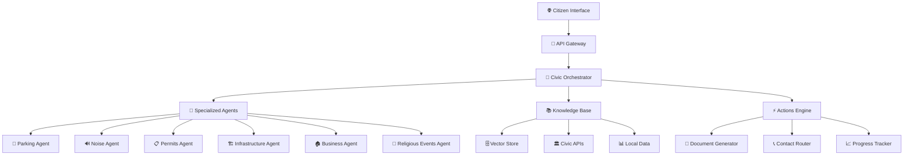

<div align="center">
  <h1>🏛️ CivicMind AI</h1>
  <p><strong>The Digital Civic Utility for Modern Communities</strong></p>
  <p><em>AI-powered civic engagement platform that transforms how citizens resolve local issues through intelligent agents and community-first solutions</em></p>
  
  <p>
    <a href="docs/quickstart.md">🚀 Quick Start</a> •
    <a href="docs/architecture.md">🏗️ Architecture</a> •
    <a href="docs/deployment.md">� Deployment</a> •
    <a href="docs/examples.md">💡 Examples</a> •
    <a href="CONTRIBUTING.md">🤝 Contributing</a>
  </p>

  
  
  
  
  
  
</div>

---

## 🌟 **What is CivicMind AI?**

> **"The digital civic utility for the modern age"**

CivicMind AI is an intelligent civic engagement platform that serves as a unified digital gateway for citizens to resolve local issues. Just as telephone booths once connected people across distances, CivicMind AI connects residents to solutions, resources, and community harmony in the digital age.

Our platform uses specialized AI agents to understand context, respect cultural values, and guide communities toward neighborly solutions before legal escalation. We prioritize building stronger, more connected communities through intelligent civic assistance.

## 🎯 **Core Mission & Values**

**Mission**: Transform civic engagement by making local government services accessible, intelligent, and community-focused.

**Core Values**:
- 🤝 **Community First** - Promote neighborly resolution over legal escalation
- 🌍 **Cultural Sensitivity** - Respect diverse traditions and community values  
- ⚡ **Immediate Action** - Provide clear, actionable guidance instantly
- 🔒 **Data Sovereignty** - Self-hosted deployment for complete control
- 💡 **Open Innovation** - Transparent, extensible, and collaborative platform

## 🏗️ **High-Level Architecture**

CivicMind AI is built as a modular, scalable framework following modern microservices principles while maintaining simplicity for self-hosted deployments.



### **Key Components**:
- **🧠 Civic Orchestrator**: LangGraph-powered workflow engine that routes issues to appropriate agents
- **� Specialized Agents**: Domain-specific AI agents for parking, noise, permits, infrastructure, etc.
- **� Knowledge Base**: Vector store with civic data, APIs, and local regulations
- **⚡ Actions Engine**: Automated document generation, contact routing, and progress tracking

*For detailed architecture documentation, see [docs/architecture.md](docs/architecture.md)*

## 🚀 **Quick Start**

### **Prerequisites**
- Python 3.11+ 🐍
- OpenAI API Key 🔑
- Git 📦

### **Installation**

```bash
# 1. Clone the repository
git clone https://github.com/rajathota/civicmind-ai.git
cd civicmind-ai

# 2. Run the automated setup
python setup.py

# 3. Configure your environment
cp .env.example .env
# Edit .env with your OpenAI API key

# 4. Start the server
python server.py
```

### **First API Call**

```bash
curl -X POST http://localhost:8000/api/v1/issues/analyze \
  -H "Content-Type: application/json" \
  -d '{
    "description": "My neighbor parks blocking my driveway daily",
    "location": "Folsom, CA",
    "priority": "medium"
  }'
```

*For detailed setup instructions, see [docs/quickstart.md](docs/quickstart.md)*

## ✨ **Key Features**

<table>
  <tr>
    <td align="center">🤖</td>
    <td><strong>Multi-Agent Intelligence</strong><br/>Specialized AI agents for parking, noise, permits, infrastructure, and community events</td>
  </tr>
  <tr>
    <td align="center">🤝</td>
    <td><strong>Community-First Approach</strong><br/>Promotes neighborly resolution before legal escalation</td>
  </tr>
  <tr>
    <td align="center">🌍</td>
    <td><strong>Cultural Sensitivity</strong><br/>Respects diverse community values and traditions</td>
  </tr>
  <tr>
    <td align="center">🔒</td>
    <td><strong>Self-Hosted Control</strong><br/>Deploy on your infrastructure for complete data sovereignty</td>
  </tr>
  <tr>
    <td align="center">⚡</td>
    <td><strong>Real-time Intelligence</strong><br/>Integration with city APIs, 311 systems, and open data portals</td>
  </tr>
  <tr>
    <td align="center">📱</td>
    <td><strong>Multi-Modal Input</strong><br/>Text, voice, and image input support (planned)</td>
  </tr>
</table>

## 🌍 **Use Cases**

### **🏘️ Neighborhood Harmony**
- Parking disputes and violations
- Noise complaints and mediation
- Property boundary issues
- Pet-related concerns

### **🏛️ Government Services**
- Building permits and licensing
- Business registration guidance
- Event planning and permits
- Zoning and planning inquiries

### **🎉 Community Events**
- Religious and cultural celebrations
- Public space usage
- Festival planning and coordination
- Community meeting organization

*For detailed examples and case studies, see [docs/examples.md](docs/examples.md)*

## 🛠️ **Technology Stack**

<div align="center">

**🧠 AI & Language Models**  
OpenAI GPT-4 • LangChain • LangGraph • LangSmith

**⚡ Backend & APIs**  
FastAPI • Python 3.11+ • PostgreSQL • Redis

**📊 Data & Vector Stores**  
ChromaDB • Weaviate • Vector Search

**🚀 Deployment**  
Docker • Kubernetes • Self-Hosted • Cloud-Native

</div>

## 📁 **Project Structure**

```
civicmind-ai/
├── �️ civicmind/                    # Core framework package
│   ├── 🧠 core/                     # Orchestration engine
│   ├── 🤖 agents/                   # Specialized AI agents
│   └── � integrations/             # External API connectors
├── � docs/                         # Comprehensive documentation
├── 🐳 deployment/                   # Deployment configurations
├── 🌐 ui/                          # Web interface (future)
├── 🧪 tests/                       # Test suites
├── 🚀 server.py                    # FastAPI application
└── ⚙️ setup.py                     # Automated installer
```

## 🤝 **Contributing**

We welcome contributions from developers, civic technologists, and community advocates!

### **Ways to Contribute**
- 🐛 Bug reports and fixes
- 💡 Feature requests and implementations
- 📝 Documentation improvements
- 🌍 Localization and cultural adaptations
- 🤖 New specialized agents

See [CONTRIBUTING.md](CONTRIBUTING.md) for detailed guidelines.

## 📄 **License**

This project is licensed under the **Apache License 2.0** - see the [LICENSE](LICENSE) file for details.

**Why Apache 2.0?** Commercial use permitted, modification allowed, patent protection included, while maintaining open-source principles.

---

<div align="center">
  <h3>🙏 Built with Community Values</h3>
  <p>
    <em>Inspired by principles of Dharma (righteousness), Ahimsa (non-violence), and Seva (service)</em><br/>
    <strong>"Technology in service of community harmony"</strong>
  </p>
  
  <p>
    <strong>🏛️ CivicMind AI - Where Technology Meets Community</strong>
  </p>
  
  <p>
    <a href="https://github.com/rajathota/civicmind-ai/stargazers">⭐ Star us on GitHub</a> •
    <a href="https://github.com/rajathota/civicmind-ai/discussions">💬 Join Discussions</a> •
    <a href="CONTRIBUTING.md">🤝 Contribute</a>
  </p>
</div>
