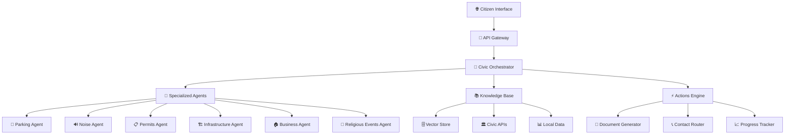
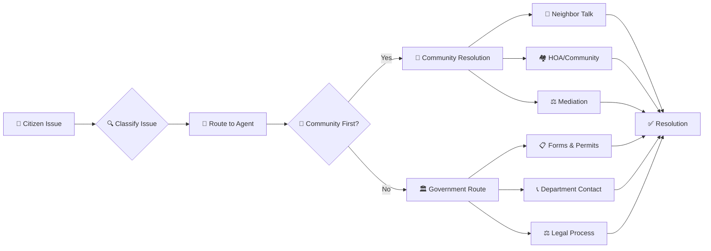
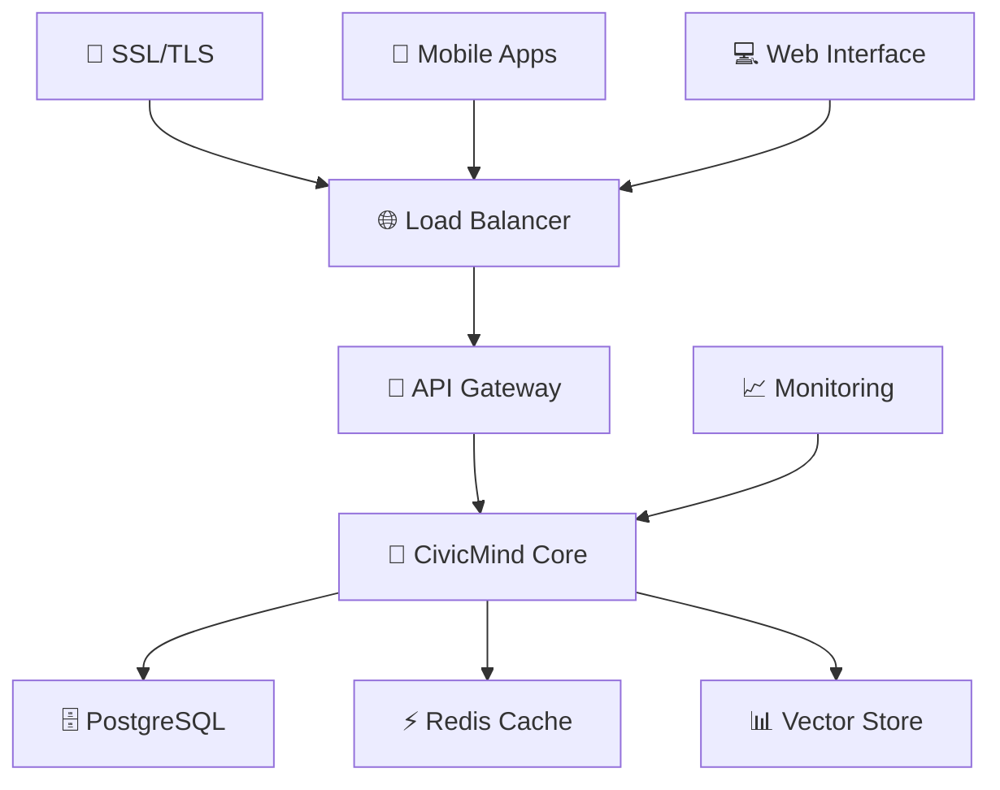
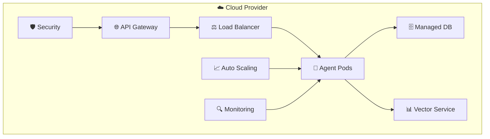
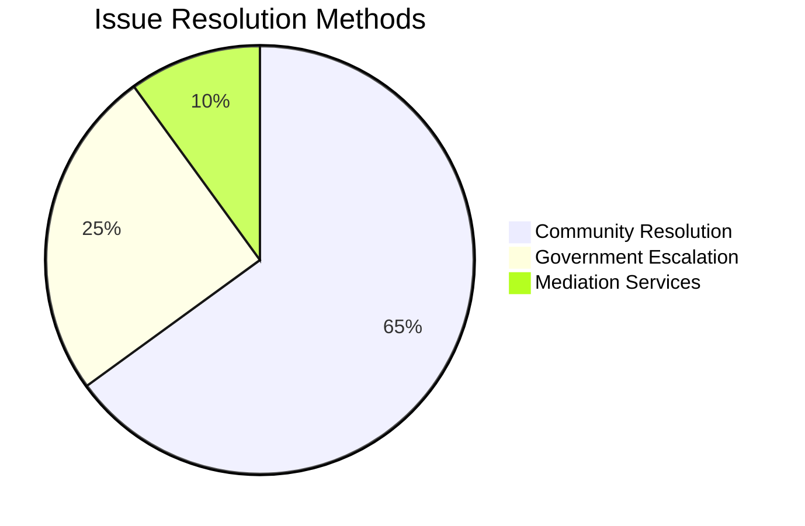

<div align="center">
 ## 🌟 **Project Mission**

> **"The digital civic utility for the modern age - transforming how communities resolve local issues through AI-guided engagement"**

CivicMind AI creates a unified digital gateway where citizens can instantly access solutions for any local issue. Just as telephone booths once served as universal communication hubs connecting people across distances, CivicMind AI serves as the modern civic infrastructure - connecting residents to the right resources, departments, and community solutions.

Our platform transforms civic engagement by providing intelligent AI agents that understand context, respect cultural values, and guide communities toward harmonious solutions. We prioritize neighborly resolution over legal escalation, creating stronger, more connected communities.

### **Why CivicMind AI?**
🔗 **Universal Access** - One platform for all civic needs, from parking disputes to cultural events  
🤖 **Intelligent Routing** - AI agents that understand your specific situation and location  
🤝 **Community Harmony** - Solutions that strengthen neighborhoods rather than divide them  
� **Cultural Respect** - Built with diverse community values and traditions in mind  
📞 **Always Available** - 24/7 civic assistance, just like the digital telephone booth of tomorrow️ CivicMind AI</h1>
  <p><strong>The Digital Civic Utility for Modern Communities</strong></p>
  <p><em>AI-powered civic engagement platform - the digital town square for citizens to resolve local issues through intelligent agents and community-first solutions</em></p>
  
  <p>
    <a href="#quick-start">🚀 Quick Start</a> •
    <a href="#features">✨ Features</a> •
    <a href="#documentation">📚 Docs</a> •
    <a href="#examples">💡 Examples</a> •
    <a href="#contributing">🤝 Contributing</a>
  </p>

  
  
  
  
  
  
</div>

---

## � **Project Mission**

> **"Building the digital telephone booth for civic engagement"**

CivicMind AI transforms how citizens interact with local government through intelligent AI agents that understand context, respect cultural values, and guide communities toward harmonious solutions.

Just as the telephone booth once connected people across distances, CivicMind AI connects citizens to solutions, resources, and their civic duties in the digital age.

## 🎯 **Core Values**

🤝 **Community First** - Prioritize local, neighborly solutions before legal escalation  
🌍 **Cultural Sensitivity** - Respect diverse traditions and community values  
⚡ **Immediate Action** - Provide clear, actionable guidance instantly  
🔒 **Data Sovereignty** - Self-hosted deployment for complete control  
💡 **Open Innovation** - Transparent, extensible, and collaborative

## 🏗️ **System Architecture**



## 🔄 **Agent Workflow**



## 🚀 Quick Start

### **Prerequisites**
- Python 3.11+ 🐍
- OpenAI API Key 🔑
- Git 📦

### **Installation**

```bash
# 1. Clone the repository
git clone https://github.com/your-username/civicmind-ai.git
cd civicmind-ai

# 2. Run the automated setup
python setup.py

# 3. Configure your environment
cp .env.example .env
# Edit .env with your OpenAI API key

# 4. Start the server
python server.py
```

### **Docker Quick Start**

```bash
# Using Docker Compose
docker-compose up -d

# Access the API
curl http://localhost:8000/health
```

### **First API Call**

```bash
curl -X POST http://localhost:8000/api/v1/issues/analyze \
  -H "Content-Type: application/json" \
  -d '{
    "description": "My neighbor parks blocking my driveway daily",
    "location": "Folsom, CA",
    "priority": "medium"
  }'
```

## ✨ Features

<table>
  <tr>
    <td align="center">🤖</td>
    <td><strong>Multi-Agent System</strong><br/>Specialized agents for parking, noise, permits, infrastructure, and more</td>
  </tr>
  <tr>
    <td align="center">🌐</td>
    <td><strong>Real-time Data</strong><br/>Integration with city APIs, 311 systems, and open data portals</td>
  </tr>
  <tr>
    <td align="center">🤝</td>
    <td><strong>Community-First</strong><br/>Promotes local resolution before legal escalation</td>
  </tr>
  <tr>
    <td align="center">🌍</td>
    <td><strong>Cultural Sensitivity</strong><br/>Respects diverse community values and traditions</td>
  </tr>
  <tr>
    <td align="center">🔒</td>
    <td><strong>Self-Hosted</strong><br/>Deploy on your own infrastructure for complete data sovereignty</td>
  </tr>
  <tr>
    <td align="center">📱</td>
    <td><strong>Multi-Modal</strong><br/>Text, voice, and image input support</td>
  </tr>
</table>

## 🌍 Use Cases

### **🏘️ Neighborhood Issues**
- Parking violations and disputes
- Noise complaints and resolution
- Property line disagreements
- Pet-related problems

### **🏛️ Government Services**
- Building and construction permits
- Business licensing guidance
- Event planning and permits
- Zoning inquiries

### **🎉 Community Events**
- Religious and cultural celebrations
- Public park usage
- Street festivals and gatherings
- Community meetings

### **🚧 Infrastructure**
- Pothole and road repairs
- Streetlight maintenance
- Water and drainage issues
- Public safety concerns

## 📁 Project Structure

```
civicmind-ai/
├── 🏛️ civicmind/                    # Core framework package
│   ├── 🧠 core/                     # Orchestration engine
│   │   ├── civic_orchestrator.py    # LangGraph workflow manager
│   │   ├── agent_factory.py         # Agent creation & management
│   │   └── config.py                # Configuration management
│   ├── 🤖 agents/                   # Specialized AI agents
│   │   ├── base_agent.py            # Base agent class
│   │   ├── parking_agent.py         # Parking issues
│   │   ├── noise_agent.py           # Noise complaints
│   │   ├── permits_agent.py         # Permits & licensing
│   │   └── ...                      # More specialized agents
│   └── 🔌 integrations/             # External API connectors
├── 📚 docs/                         # Documentation
│   ├── quickstart.md                # Getting started guide
│   ├── architecture.md              # System architecture
│   └── examples.md                  # Usage examples
├── 🐳 deployment/                   # Deployment configs
│   ├── docker-compose.yml           # Multi-service deployment
│   └── kubernetes/                  # K8s manifests
├── 🌐 ui/                          # Web interface (future)
├── 🧪 tests/                       # Test suites
├── 📋 requirements.txt              # Python dependencies
├── 🚀 server.py                    # FastAPI application
├── ⚙️ setup.py                     # Automated installer
└── 📄 README.md                    # This file
```

## 🛠️ Technology Stack

<div align="center">

### **🧠 AI & Language Models**


### **⚡ Backend & APIs**


### **📊 Data & Vector Stores**


### **🚀 Deployment & DevOps**


</div>

## 🏗️ Deployment Options

### **🏠 Self-Hosted (Recommended)**


**Benefits:**
- 🔒 Complete data sovereignty
- 💰 Cost-effective for small deployments
- 🎨 Fully customizable for local needs
- 📊 Direct control over analytics

### **☁️ Cloud-Native**


**Benefits:**
- 📈 Auto-scaling capabilities
- 🌍 Multi-region deployment
- 🛡️ Enterprise security features
- 🔧 Managed services integration

## 💡 **Real-World Examples**

### **Example 1: Neighbor Parking Dispute** 🚗
```python
response = requests.post("/api/v1/issues/analyze", json={
    "description": "My neighbor parks blocking my driveway every night",
    "location": "Folsom, CA"
})

# CivicMind suggests community-first approach:
# 1. Friendly neighbor conversation
# 2. HOA mediation if available  
# 3. City parking enforcement as last resort
```

### **Example 2: Cultural Event Planning** 🎉
```python
response = requests.post("/api/v1/agents/religious_events/analyze", json={
    "description": "Planning Diwali celebration with 100+ people in community park",
    "location": "Fremont, CA"
})

# Gets culturally-sensitive guidance:
# - Event permit requirements
# - Sound/amplification rules
# - Food vendor licensing
# - Parking arrangements
```

### **Example 3: Infrastructure Issue** 🚧
```python
response = requests.post("/api/v1/agents/infrastructure/analyze", json={
    "description": "Large pothole causing car damage on Oak Street",
    "location": "Sacramento, CA",
    "priority": "high"
})

# Provides immediate action plan:
# - Department of Public Works contact
# - Incident reporting form
# - Photo documentation guidance
# - Damage claim process
```

## 🎨 **Customization & Extension**

### **Adding Custom Agents**
```python
from civicmind.agents.base_agent import BaseCivicAgent

class LocalBusinessAgent(BaseCivicAgent):
    def get_system_prompt(self):
        return """
        You are a local business licensing specialist for [Your City].
        Provide guidance on permits, regulations, and support resources.
        """
    
    def analyze_issue(self, description, location, context):
        # Your custom business logic
        pass

# Register with the framework
factory.register_agent("local_business", LocalBusinessAgent)
```

### **Integration with City APIs**
```python
# Connect to your city's 311 system
from civicmind.integrations.city_api import CityAPI

city_api = CityAPI(base_url="https://your-city.gov/api")
city_api.register_webhook("/civic-issues", civicmind_handler)
```

## 📊 **Analytics & Insights**

Track community engagement and resolution patterns:



## 🤝 **Contributing**

We welcome contributions from developers, civic technologists, and community advocates!

### **Ways to Contribute**
- 🐛 **Bug Reports**: Help us improve stability
- 💡 **Feature Requests**: Suggest new capabilities  
- 📝 **Documentation**: Improve guides and examples
- 🌍 **Localization**: Add support for more languages/regions
- 🤖 **New Agents**: Create specialized agents for different civic domains

### **Development Setup**
```bash
# Fork the repository
git clone https://github.com/your-username/civicmind-ai.git

# Create development environment
python -m venv venv
source venv/bin/activate  # On Windows: venv\Scripts\activate

# Install development dependencies
pip install -r requirements-dev.txt

# Run tests
pytest

# Start development server with hot reload
python server.py --reload
```

### **Code Standards**
- Follow PEP 8 style guidelines
- Include type hints for all functions
- Write comprehensive docstrings
- Add tests for new features
- Maintain cultural sensitivity in all agents

## 🔒 **Security & Privacy**

### **Data Protection**
- 🔐 **Encryption**: All data encrypted at rest and in transit
- 🏠 **Self-Hosted**: Keep citizen data on your own infrastructure
- 🔍 **Minimal Collection**: Only collect necessary information
- ⏰ **Auto-Expiry**: Automatic data retention policies

### **Privacy-First Design**
- Anonymous usage analytics
- Opt-in data sharing
- GDPR/CCPA compliance ready
- No tracking without consent

## 📈 **Roadmap**

### **Phase 1: Core Framework** ✅
- [x] Multi-agent orchestration
- [x] Basic civic agents (parking, noise, permits)
- [x] REST API with OpenAPI docs
- [x] Docker deployment

### **Phase 2: Enhanced Features** 🚧
- [ ] Web interface development
- [ ] Voice input/output capabilities
- [ ] Image analysis for civic issues
- [ ] Mobile app development

### **Phase 3: Scale & Integration** 🔮
- [ ] Multi-language support
- [ ] Government API marketplace
- [ ] Advanced analytics dashboard
- [ ] Federated learning across cities

## 🌟 **Community**

Join our growing community of civic technologists:

- 💬 **Discussions**: [GitHub Discussions](https://github.com/your-username/civicmind-ai/discussions)
- 📧 **Mailing List**: civicmind-community@googlegroups.com
- 🐦 **Twitter**: [@CivicMindAI](https://twitter.com/civicmindai)
- 📺 **YouTube**: [CivicMind AI Channel](https://youtube.com/civicmindai)

## 📄 **License**

This project is licensed under the **Apache License 2.0** - see the [LICENSE](LICENSE) file for details.

### **Why Apache 2.0?**
- ✅ Commercial use permitted
- ✅ Modification and distribution allowed  
- ✅ Patent protection included
- ✅ Private use permitted
- ⚠️ Trademark use not permitted
- ⚠️ Liability and warranty disclaimers

---

<div align="center">
  <h3>🙏 Built with Community Values</h3>
  <p>
    <em>Inspired by the principles of Dharma, Ahimsa, and Seva</em><br/>
    <strong>"The digital civic utility for the modern age"</strong>
  </p>
  
  <p>
    <em>Just as telephone booths once connected people across distances,<br/>
    CivicMind AI connects citizens to solutions, resources, and their civic duties in the digital age.</em>
  </p>
  
  <p>
    <strong>Doing right by our communities, one civic issue at a time</strong><br/>
    Made with ❤️ by civic technologists worldwide
  </p>
  
  <p>
    <a href="https://github.com/your-username/civicmind-ai/stargazers">⭐ Star us on GitHub</a> •
    <a href="https://github.com/your-username/civicmind-ai/discussions">💬 Join Discussions</a> •
    <a href="#contributing">🤝 Contribute</a>
  </p>
  
  <p>
    <strong>🏛️ CivicMind AI - Where Technology Meets Community</strong>
  </p>
</div>
