<div align="center">
  <h1>🏛️ CivicMind AI</h1>
  <p><strong>Next-Generation Civic Technology Platform</strong></p>
  <p><em>Production-ready microservices architecture with AI-powered civic agents, service discovery, and intelligent orchestration for modern government digital transformation</em></p>
  <p>
    <a href="docs/quickstart.md">🚀 Quick Start</a> •
    <a href="docs/architecture.md">🏗️ Architecture</a> •
    <a href="IMPLEMENTATION_COMPLETE.md">📋 Implementation Guide</a> •
    <a href="docs/examples/">💡 Examples</a> •
    <a href="CONTRIBUTING.md">🤝 Contributing</a>
  </p>
  
  
  
  
  
  
</div>

---

---


---


## 🔭 **Vision: The Digital Civic Infrastructure of Tomorrow**

CivicMind AI is designed to be the universal civic assistant for modern communities. Our platform empowers residents and governments to resolve issues, access resources, and foster community harmony through intelligent automation and AI-powered microservices.

Ask a question like: *"My neighbor's construction starts at 5 AM every day"* and instantly receive:
- **Regulation lookup** from local ordinance databases
- **AI-powered mediation suggestions** for neighborly resolution
- **Automated complaint filing** with jurisdiction routing
- **Real-time case tracking** with expected resolution timelines
- **Community resource connections** for ongoing support

This is not just civic tech—it's a scalable, intelligent infrastructure for cities and neighborhoods, powered by production-grade microservices and AI agents.

### 🎯 **The Platform Advantage:**
- **🏗️ Microservices Architecture**: Each civic domain operates independently with specialized AI agents
- **🔍 Intelligent Service Discovery**: Consul-powered dynamic routing and health monitoring  
- **🤖 AI-First Design**: Model Context Protocol (MCP) integration for contextual civic assistance
- **⚡ Production-Ready**: Built for city-scale deployment with monitoring, caching, and observability
- **🔒 Municipal Control**: Self-hosted deployment for complete data sovereignty

---

## 🏗️ **Advanced Architecture Overview**

CivicMind AI implements a sophisticated microservices architecture following modern cloud-native patterns with AI-first design principles for city-scale civic technology deployment.

### 🔧 **Core Architecture Components**

| Layer | Component | Purpose | Technology |
|-------|-----------|---------|------------|
| **🌐 Frontend** | Web/Mobile Apps | Citizen interface with responsive design | React/Next.js, PWA |
| **🚪 Gateway** | API Gateway | Intelligent routing, rate limiting, auth | Kong/Envoy, OAuth2/JWT |
| **🎭 Orchestration** | Civic Orchestrator | Workflow coordination, circuit breakers | Python/FastAPI, Istio |
| **🔍 Discovery** | Consul Cluster | Service discovery, health checks, config | HashiCorp Consul |
| **🤖 MCP Agents** | AI-Powered Tools | Domain-specific civic intelligence | MCP Protocol, LLMs |
| **🏛️ API Services** | REST APIs | CRUD operations, business logic | FastAPI, OpenAPI |
| **🌐 Integration** | External APIs | Government systems, 311, GIS | REST/GraphQL adapters |
| **💾 Data Layer** | Multi-store | Caching, persistence, search, vectors | Redis, PostgreSQL, ES |
| **📊 Observability** | Full-stack monitoring | Metrics, logs, traces, alerts | Prometheus, Grafana, Jaeger |

### 🌟 **What Makes CivicMind AI Different?**

#### 🧠 **AI-First Civic Intelligence**
Unlike traditional e-government platforms, CivicMind AI treats artificial intelligence as a first-class citizen in civic service delivery:

```python
# Example: Intelligent Issue Classification
citizen_request = "My neighbor parks blocking my driveway every night"

# AI Agent analyzes context and routes appropriately
classification = await parking_agent.analyze_issue(
    text=citizen_request,
    location="Downtown District", 
    citizen_history=previous_interactions
)

# Result: Intelligent routing with context
{
    "service": "parking-violations",
    "confidence": 0.95,
    "suggested_actions": [
        "Document violations with photos",
        "Contact parking enforcement", 
        "Attempt neighborly resolution first"
    ],
    "legal_context": "City Ordinance 12.3.4 - Driveway Blocking",
    "estimated_resolution": "3-5 business days"
}
```

#### 🏗️ **Production-Grade Microservices**
Built for city-scale deployment with enterprise reliability patterns:

- **Circuit Breakers**: Prevent cascade failures when external APIs are down
- **Retry Logic**: Exponential backoff for resilient external integrations  
- **Rate Limiting**: Protect services from abuse while ensuring fair access
- **Health Monitoring**: Automatic service recovery and intelligent routing
- **Auto-scaling**: Kubernetes HPA based on citizen demand patterns

#### 🔍 **Dynamic Service Discovery**
Consul-powered infrastructure that adapts to changing municipal needs:

```yaml
# Service automatically registers and becomes discoverable
service:
  name: "civicmind-transportation-service"
  port: 8009
  health_check:
    http: "/health"
    interval: "10s"
  metadata:
    civic_domain: "transportation"
    ai_agent_port: "9309"
    capabilities: ["route_planning", "transit_schedules", "accessibility"]
```

#### 🤖 **Standardized AI Integration**
Model Context Protocol (MCP) enables consistent AI capabilities across all civic domains:

```python
# All civic agents follow the same interface pattern
class CivicMCPAgent:
    async def list_tools(self) -> List[Tool]:
        """Expose civic tools like eligibility_check, form_filling, etc."""
        
    async def list_resources(self) -> List[Resource]: 
        """Provide civic resources like regulations, forms, contacts"""
        
    async def call_tool(self, name: str, args: dict) -> ToolResult:
        """Execute civic actions with AI assistance"""
```

## 🌟 **What is CivicMind AI?**

> **"The digital civic utility for the modern age"**

CivicMind AI implements these principles through a comprehensive microservices platform that revolutionizes how citizens interact with government services. Just as telephone booths once connected people across distances, CivicMind AI connects residents to solutions, resources, and community harmony through intelligent AI agents and scalable civic services.

Our platform uses specialized AI agents powered by the Model Context Protocol (MCP) to understand context, respect cultural values, and provide actionable guidance across 8 core civic domains. We prioritize building stronger, more connected communities through intelligent civic assistance.

## 🎯 **Core Mission & Values**

**Mission**: Transform civic engagement by making local government services accessible, intelligent, and community-focused through modern microservices architecture.

**Core Values**:
- 🤝 **Community First** - Promote neighborly resolution and collaborative solutions
- 🏗️ **Scalable Architecture** - Modern microservices for reliable, maintainable civic infrastructure
- ⚡ **Immediate Action** - Provide clear, actionable guidance through intelligent automation
- 🔒 **Data Sovereignty** - Self-hosted deployment options for complete municipal control
- 💡 **Open Innovation** - Transparent, extensible, and collaborative platform development

## �️ **Microservices Architecture**

CivicMind AI is built as a modern, scalable microservices platform following cloud-native principles while maintaining simplicity for municipal deployments.

```mermaid
graph TB
    subgraph "Citizen Interface"
        Citizens[👤 Citizens] 
        WebApp[🌐 Web Application]
        Mobile[📱 Mobile App]
    end
    
    subgraph "API Layer"
        Gateway[🚪 API Gateway :8300]
        Orchestrator[🎭 Orchestrator :8000]
    end
    
    subgraph "Civic Service APIs"
        API1[🚗 Parking Service :8001]
        API2[📋 Permits Service :8002]
        API3[🔇 Noise Service :8003]
        API4[⚡ Utilities Service :8004]
        API5[🏠 Housing Service :8005]
        API6[🏢 Business Service :8006]
        API7[🛡️ Safety Service :8007]
        API8[🌱 Environmental Service :8008]
    end
    
    subgraph "MCP AI Agents"
        MCP1[🤖 Parking Agent :9300]
        MCP2[🤖 Permits Agent :9301]
        MCP3[🤖 Noise Agent :9302]
        MCP4[🤖 Utilities Agent :9303]
        MCP5[🤖 Housing Agent :9304]
        MCP6[🤖 Business Agent :9305]
        MCP7[🤖 Safety Agent :9306]
        MCP8[🤖 Environmental Agent :9307]
    end
    
    subgraph "Data Layer"
        SharedLib[📚 Shared Library]
        Database[(🗄️ PostgreSQL)]
        Cache[(⚡ Redis)]
        Vector[(🧠 Vector Store)]
    end
    
    Citizens --> WebApp
    Citizens --> Mobile
    WebApp --> Gateway
    Mobile --> Gateway
    
    Gateway --> Orchestrator
    Orchestrator --> API1
    Orchestrator --> API2
    Orchestrator --> API3
    Orchestrator --> API4
    
    API1 <--> MCP1
    API2 <--> MCP2
    API3 <--> MCP3
    API4 <--> MCP4
    
    API1 --> SharedLib
    API2 --> SharedLib
    MCP1 --> SharedLib
    MCP2 --> SharedLib
    
    SharedLib --> Database
    SharedLib --> Cache
    SharedLib --> Vector
```



### **Key Components**:

<table>
  <tr>
    <td align="center">🚪</td>
    <td><strong>API Gateway (Port 8300)</strong><br/>Intelligent request routing, authentication, rate limiting, and service discovery</td>
  </tr>
  <tr>
    <td align="center">🎭</td>
    <td><strong>Orchestrator (Port 8000)</strong><br/>Workflow coordination, multi-service transactions, and complex civic processes</td>
  </tr>
  <tr>
    <td align="center">🏛️</td>
    <td><strong>Civic Service APIs (8001-8008)</strong><br/>Domain-specific REST APIs for each civic service area with full CRUD operations</td>
  </tr>
  <tr>
    <td align="center">🤖</td>
    <td><strong>MCP AI Agents (9300-9307)</strong><br/>Specialized AI agents using Model Context Protocol for intelligent civic assistance</td>
  </tr>
  <tr>
    <td align="center">📚</td>
    <td><strong>Shared Library</strong><br/>Common models, utilities, authentication, and database abstractions</td>
  </tr>
</table>

### **Service Domains**:

| Domain | API Service | MCP Agent | AI Capabilities |
|--------|-------------|-----------|----------------|
| **🚗 Parking** | Port 8001 | Port 9300 | Smart parking assistance, violation resolution, permit guidance |
| **📋 Permits** | Port 8002 | Port 9301 | Application guidance, requirement analysis, process automation |
| **🔇 Noise** | Port 8003 | Port 9302 | Automated complaint filing, regulation lookup, mediation support |
| **⚡ Utilities** | Port 8004 | Port 9303 | Outage reporting, service scheduling, billing assistance |
| **🏠 Housing** | Port 8005 | Port 9304 | Eligibility checking, program matching, code compliance |
| **🏢 Business** | Port 8006 | Port 9305 | Business setup guidance, incentive discovery, licensing |
| **🛡️ Safety** | Port 8007 | Port 9306 | Hazard reporting, safety compliance, emergency coordination |
| **🌱 Environmental** | Port 8008 | Port 9307 | Regulation compliance, sustainability programs, waste management |

*For detailed architecture documentation, see [docs/architecture.md](docs/architecture.md)*

## 🚀 **Quick Start**

### **Prerequisites**
- Python 3.11+ 🐍
- Docker & Docker Compose 🐳
- Git 📦

### **Installation**

```bash
# 1. Clone the repository
git clone https://github.com/rajathota/civicmind-ai.git
cd civicmind-ai

# 2. Install shared library
cd shared-lib
pip install -e .
cd ..

# 3. Start core services
./scripts/start-dev.sh

# Alternative: Docker Compose
docker compose -f deployment/docker-compose.dev.yml up
```

### **First API Call**

```bash
# Test citizen request routing
curl -X POST "http://localhost:8300/api/v1/issues/analyze" \
  -H "Content-Type: application/json" \
  -d '{
    "query": "My neighbor parks blocking my driveway every night",
    "location": "Downtown District",
    "priority": "medium"
  }'
```

**Expected Response:**
```json
{
  "service": "parking-service",
  "confidence": 0.95,
  "response": {
    "issue_type": "parking_violation", 
    "suggested_actions": ["Contact parking enforcement", "Document violations"],
    "next_steps": "File complaint through parking service",
    "agent_analysis": "This appears to be a recurring parking violation..."
  }
}
```

### **Service Health Check**

```bash
# Check all services
curl http://localhost:8300/health   # API Gateway
curl http://localhost:8000/health   # Orchestrator
curl http://localhost:8001/health   # Parking Service
curl http://localhost:9300/health   # Parking MCP Agent
```

*For detailed setup instructions, see [docs/quickstart.md](docs/quickstart.md)*

## ✨ **Key Features**

<table>
  <tr>
    <td align="center">🤖</td>
    <td><strong>Multi-Agent Intelligence</strong><br/>Specialized AI agents for all civic domains using Model Context Protocol (MCP)</td>
  </tr>
  <tr>
    <td align="center">🏗️</td>
    <td><strong>Microservices Architecture</strong><br/>Independent, scalable services with Docker containerization and Kubernetes support</td>
  </tr>
  <tr>
    <td align="center">🚪</td>
    <td><strong>Intelligent API Gateway</strong><br/>Smart request routing, rate limiting, authentication, and service discovery</td>
  </tr>
  <tr>
    <td align="center">🤝</td>
    <td><strong>Community-First Approach</strong><br/>Promotes neighborly resolution before legal escalation</td>
  </tr>
  <tr>
    <td align="center">⚡</td>
    <td><strong>Real-time Intelligence</strong><br/>Integration with city APIs, 311 systems, and open data portals</td>
  </tr>
  <tr>
    <td align="center">🔒</td>
    <td><strong>Self-Hosted Control</strong><br/>Deploy on municipal infrastructure for complete data sovereignty</td>
  </tr>
  <tr>
    <td align="center">📱</td>
    <td><strong>Multi-Modal Input</strong><br/>Text, voice, and image input support with extensible interface design</td>
  </tr>
  <tr>
    <td align="center">🔧</td>
    <td><strong>Extensible Platform</strong><br/>Easy integration with existing government systems and legacy infrastructure</td>
  </tr>
</table>

## 🌍 **Use Cases**

### **🏘️ Neighborhood Harmony**
- **Parking Disputes**: Intelligent violation reporting, permit guidance, neighbor mediation
- **Noise Complaints**: Automated filing, regulation lookup, community mediation support
- **Property Issues**: Boundary disputes, maintenance concerns, HOA coordination
- **Pet-Related Concerns**: Registration assistance, complaint mediation, regulation guidance

### **🏛️ Government Services**
- **Building Permits**: Application guidance, requirement analysis, process automation
- **Business Registration**: Setup guidance, incentive discovery, licensing automation
- **Event Planning**: Permit coordination, public space usage, community event support
- **Zoning Inquiries**: Regulation lookup, compliance checking, planning assistance

### **🎉 Community Events**
- **Religious Celebrations**: Event permit coordination, noise regulation guidance
- **Cultural Festivals**: Multi-department coordination, safety planning, permit automation
- **Public Gatherings**: Space reservation, permit routing, community notification
- **Neighborhood Meetings**: Venue coordination, official filing, community outreach

### **🚨 Emergency & Safety**
- **Hazard Reporting**: Automated routing, follow-up tracking, resolution coordination
- **Safety Inspections**: Scheduling automation, compliance checking, violation resolution
- **Emergency Coordination**: Multi-service response, resource allocation, public notification
- **Infrastructure Issues**: Utility outage reporting, road maintenance, public safety alerts

*For detailed examples and case studies, see [docs/examples/](docs/examples/)*

## 🛠️ **Technology Stack**

<div align="center">

**🤖 AI & Agents**  
Model Context Protocol (MCP) • FastAPI • Python 3.11+ • Vector Databases

**🏗️ Microservices**  
FastAPI • Docker • Kubernetes • API Gateway • Service Mesh

**📊 Data & Storage**  
PostgreSQL • Redis • Vector Search • Shared Libraries

**🚀 Deployment & DevOps**  
Docker Compose • Kubernetes • Helm Charts • CI/CD • Monitoring

**🔧 Integration**  
REST APIs • OpenAPI • Webhook Support • Legacy System Adapters

</div>

## 📁 **Project Structure**

```
civicmind-ai/
├── 🏗️ independent-services/          # Microservices architecture
│   ├── 🚪 civicmind-api-gateway/     # API Gateway (Port 8300)
│   ├── 🎭 civicmind-orchestrator-service/  # Workflow coordination (Port 8000)
│   ├── 🚗 civicmind-parking-service/       # Parking domain API (Port 8001)
│   ├── 📋 civicmind-permits-service/       # Permits domain API (Port 8002)
│   ├── 🤖 civicmind-parking-mcp-server/    # Parking AI agent (Port 9300)
│   ├── 🤖 civicmind-permits-mcp-server/    # Permits AI agent (Port 9301)
│   ├── 🤖 civicmind-noise-mcp-server/      # Noise AI agent (Port 9302)
│   ├── 🤖 civicmind-utilities-mcp-server/  # Utilities AI agent (Port 9303)
│   ├── 🤖 civicmind-housing-mcp-server/    # Housing AI agent (Port 9304)
│   ├── 🤖 civicmind-business-mcp-server/   # Business AI agent (Port 9305)
│   ├── 🤖 civicmind-safety-mcp-server/     # Safety AI agent (Port 9306)
│   └── 🤖 civicmind-environmental-mcp-server/  # Environmental AI agent (Port 9307)
├── 📚 shared-lib/                     # Common libraries and models
│   └── civicmind_common/              # Shared utilities, auth, database
├── 📖 docs/                          # Comprehensive documentation
│   ├── architecture.md               # System architecture details
│   ├── deployment.md                 # Deployment strategies
│   ├── quickstart.md                 # Getting started guide
│   └── examples/                     # Tutorials and examples
├── 🚢 deployment/                    # Infrastructure configurations
│   ├── docker-compose.dev.yml        # Development environment
│   ├── docker-compose.prod.yml       # Production deployment
│   └── kubernetes/                   # K8s manifests and Helm charts
├── 🧪 tests/                         # Comprehensive test suites
├── 🌐 ui/                            # Web interface (future)
├── 🚀 server.py                      # Legacy single-service entry (deprecated)
└── ⚙️ setup.py                       # Automated installer and dependencies
```

## 🤖 **Building an AI Agent Example**

Create a new MCP server for a custom civic domain:

```python
"""Transportation MCP Server Example"""
import asyncio
from mcp.server import Server
from mcp.server.stdio import stdio_server
from mcp.types import Resource, Tool, TextContent
from civicmind_common.models import TransportationRequest
from civicmind_common.clients import TransportationServiceClient

class TransportationMCPServer:
    def __init__(self):
        self.server = Server("transportation-mcp-server")
        self.service_client = TransportationServiceClient()
        self._setup_handlers()
    
    def _setup_handlers(self):
        @self.server.list_resources()
        async def handle_list_resources():
            return [
                Resource(
                    uri="transportation://routes",
                    name="Public Transit Routes",
                    description="Bus and train route information",
                    mimeType="application/json"
                )
            ]
        
        @self.server.list_tools()
        async def handle_list_tools():
            return [
                Tool(
                    name="find_route",
                    description="Find optimal public transit route",
                    inputSchema={
                        "type": "object",
                        "properties": {
                            "from": {"type": "string", "description": "Origin location"},
                            "to": {"type": "string", "description": "Destination location"},
                            "time": {"type": "string", "description": "Preferred departure time"}
                        },
                        "required": ["from", "to"]
                    }
                )
            ]
        
        @self.server.call_tool()
        async def handle_call_tool(name: str, arguments: dict):
            if name == "find_route":
                # Use shared service client
                route_result = await self.service_client.find_optimal_route(
                    from_location=arguments["from"],
                    to_location=arguments["to"],
                    departure_time=arguments.get("time")
                )
                return [TextContent(type="text", text=route_result)]

# Start the server
async def main():
    server = TransportationMCPServer()
    async with stdio_server() as (read_stream, write_stream):
        await server.server.run(read_stream, write_stream)

if __name__ == "__main__":
    asyncio.run(main())
```

*For complete tutorials, see [docs/examples/building-an-agent.md](docs/examples/building-an-agent.md)*

## 🚢 **Deployment**

### **Development Environment**
```bash
# Quick start with Docker Compose
docker compose -f deployment/docker-compose.dev.yml up

# Or start services individually for development
./scripts/start-dev.sh
```

### **Production Deployment**
```bash
# Production deployment with scaling
docker compose -f deployment/docker-compose.prod.yml up -d

# Kubernetes deployment
kubectl apply -f deployment/kubernetes/
helm install civicmind-ai deployment/helm/
```

### **Service Monitoring**
```bash
# Health checks for all services
curl http://localhost:8300/health   # API Gateway
curl http://localhost:8000/health   # Orchestrator
curl http://localhost:8001/health   # Parking Service

# Metrics and monitoring
docker compose -f deployment/docker-compose.prod.yml logs -f
```

*For comprehensive deployment strategies, see [docs/deployment.md](docs/deployment.md)*

## 🧪 **Testing**

### **Running Tests**
```bash
# Unit tests
pytest tests/unit/

# Integration tests  
pytest tests/integration/

# End-to-end tests
pytest tests/e2e/

# Load testing
locust -f tests/load/locustfile.py --host=http://localhost:8300
```

### **API Testing Examples**
```bash
# Test API Gateway intelligent routing
curl -X POST "http://localhost:8300/api/v1/issues/analyze" \
  -H "Content-Type: application/json" \
  -d '{"query": "I need a building permit for my garage"}'

# Test MCP server directly
curl -X POST "http://localhost:9301/mcp/tools/list" \
  -H "Content-Type: application/json"

# Multi-service workflow test
curl -X POST "http://localhost:8000/api/v1/workflows/restaurant-opening" \
  -H "Content-Type: application/json" \
  -d '{"business_name": "Test Restaurant", "location": "Downtown"}'
```

## 📚 **Documentation**

### **Developer Guides**
- [**Architecture Overview**](docs/architecture.md) - Microservices design and components
- [**Deployment Guide**](docs/deployment.md) - Development to production deployment strategies
- [**API Reference**](docs/api-reference.md) - Complete REST API and MCP protocol documentation
- [**Service Development**](docs/service-development.md) - Creating new civic services and MCP agents

### **Examples & Tutorials**
- [**Building Your First Agent**](docs/examples/building-an-agent.md) - Step-by-step MCP agent creation tutorial
- [**Custom Service Integration**](docs/examples/custom-service.md) - Adding new civic domains to the platform
- [**Advanced Orchestration**](docs/examples/orchestration.md) - Multi-service workflow coordination
- [**Municipal Implementation**](docs/examples/municipal-implementation.md) - Government adoption strategies

### **Implementation Guides**
- [**Integration Patterns**](docs/integration-patterns.md) - Legacy system integration approaches
- [**Security Best Practices**](docs/security.md) - Government-grade security implementation
- [**Scaling Strategies**](docs/scaling.md) - Performance optimization and horizontal scaling

## 🤝 **Contributing**

We welcome contributions from developers, civic technologists, municipal governments, and community advocates!

### **Ways to Contribute**
- 🐛 **Bug Reports & Fixes**: Help us improve platform reliability
- 💡 **Feature Development**: Implement new civic services and AI agents
- 📝 **Documentation**: Improve guides, tutorials, and API documentation
- 🌍 **Localization**: Adapt platform for different municipalities and cultures
- 🤖 **AI Agent Development**: Create specialized agents for new civic domains
- 🏗️ **Architecture Improvements**: Enhance microservices design and scalability
- 🧪 **Testing**: Expand test coverage and quality assurance

### **Development Workflow**
1. **Fork the repository** and create a feature branch
2. **Follow coding standards**: Black formatting, type hints, comprehensive tests
3. **Update documentation**: Include API docs and usage examples
4. **Test thoroughly**: Unit, integration, and end-to-end tests
5. **Submit pull request**: Clear description with implementation details

### **Coding Standards**
- **Python**: Black formatting, flake8 linting, type hints required
- **API Design**: RESTful principles, OpenAPI documentation, versioning
- **MCP Protocol**: Follow Model Context Protocol specifications strictly
- **Testing**: Minimum 80% test coverage for all new functionality
- **Documentation**: Clear docstrings, API examples, deployment guides

### **Adding New Services**
1. **Use Service Templates**: Copy existing service structure from shared-lib
2. **Implement Domain Logic**: Create civic domain-specific business rules
3. **MCP Integration**: Develop AI agent with appropriate resources and tools
4. **API Documentation**: Generate OpenAPI specs and usage examples
5. **Service Registration**: Add service to API Gateway auto-discovery

*See [CONTRIBUTING.md](CONTRIBUTING.md) for detailed guidelines and development setup.*

## 📄 **License**

This project is licensed under the **Apache License 2.0** - see the [LICENSE](LICENSE) file for details.

**Why Apache 2.0?** 
- ✅ Commercial use permitted for municipal deployments
- ✅ Modification allowed for local government customization
- ✅ Patent protection included for enterprise adoption
- ✅ Maintains open-source principles and community collaboration

## 🆘 **Support & Community**

- **📖 Documentation**: [Complete platform docs](docs/)
- **🐛 Issues**: [GitHub Issues](https://github.com/rajathota/civicmind-ai/issues)  
- **💬 Discussions**: [GitHub Discussions](https://github.com/rajathota/civicmind-ai/discussions)
- **📧 Email**: civicmind-support@community.ai
- **🏛️ Municipal Partnership**: partnerships@civicmind.ai

## 🌟 **Roadmap**

### **Phase 1 - Core Platform** ✅
- [x] Microservices architecture with Docker containerization
- [x] API Gateway with intelligent request routing
- [x] Model Context Protocol (MCP) integration for AI agents
- [x] 8 civic domain MCP servers with specialized capabilities
- [x] Shared library with common models and utilities

### **Phase 2 - Enhanced Functionality** 🔄
- [ ] Complete REST API services for all civic domains (8001-8008)
- [ ] Advanced workflow orchestration with multi-service transactions
- [ ] Real-time notifications and webhook integrations
- [ ] Web and mobile application interfaces
- [ ] Production-ready monitoring and observability

### **Phase 3 - Enterprise Features** 📋
- [ ] Multi-tenant architecture for municipal hosting
- [ ] Advanced analytics dashboard with civic insights
- [ ] Third-party integrations (311 systems, GIS, payment processors)
- [ ] Enterprise security features and compliance certification
- [ ] Kubernetes operators and automated scaling

### **Phase 4 - AI Enhancement** 🤖
- [ ] Voice interface integration with speech recognition
- [ ] Predictive service recommendations using machine learning
- [ ] Automated issue resolution and workflow completion
- [ ] Sentiment analysis and citizen satisfaction tracking
- [ ] Computer vision for image-based issue reporting

---

<div align="center">
  <h3>🙏 Built with Community Values</h3>
  <p>
    <em>Inspired by principles of Dharma (righteousness), Ahimsa (non-violence), and Seva (service)</em><br/>
    <strong>"Technology in service of community harmony"</strong>
  </p>
  
  <p>
    <strong>🏛️ CivicMind AI - Where Technology Meets Community</strong>
  </p>
  
  <p>
    <a href="https://github.com/rajathota/civicmind-ai/stargazers">⭐ Star us on GitHub</a> •
    <a href="https://github.com/rajathota/civicmind-ai/discussions">💬 Join Discussions</a> •
    <a href="CONTRIBUTING.md">🤝 Contribute</a>
  </p>
</div>
