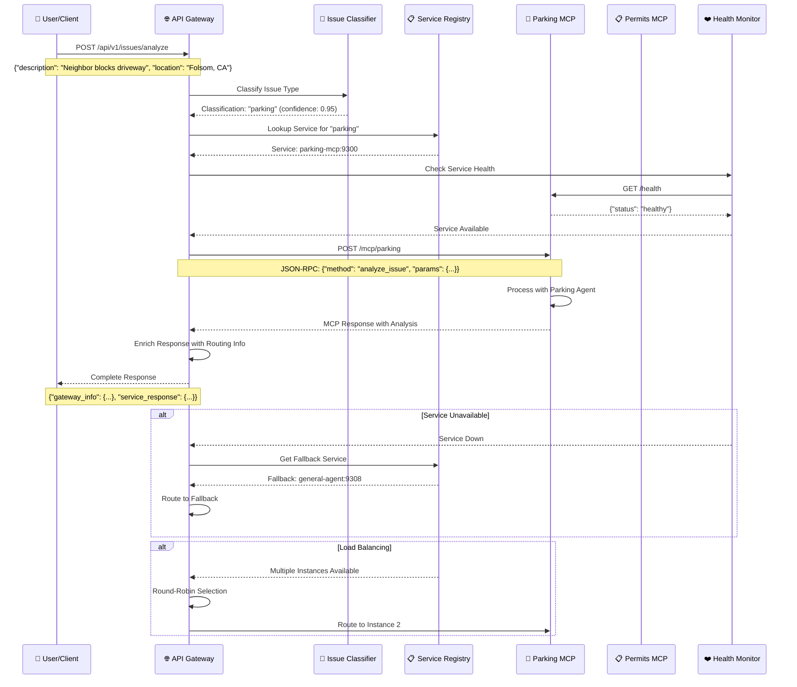

# 🏗️ CivicMind AI Architecture Diagrams

Comprehensive high-level component diagrams showing the complete CivicMind AI microservices architecture.

## 📋 Table of Contents

1. [🌐 System Overview](#-system-overview)
2. [🔄 Multi-Repository Architecture](#-multi-repository-architecture)
3. [🤖 MCP Server Architecture](#-mcp-server-architecture)
4. [🚀 API Gateway Flow](#-api-gateway-flow)
5. [🏢 Deployment Architecture](#-deployment-architecture)
6. [📊 Data Flow Diagrams](#-data-flow-diagrams)
7. [🔒 Security Architecture](#-security-architecture)

---

## 🌐 **System Overview**

```mermaid
graph TB
    subgraph "🌐 User Interfaces"
        WEB[🖥️ Web Interface]
        MOBILE[📱 Mobile App]
        CLI[💻 CLI Tool]
        API_CLIENT[🔌 API Clients]
    end

    subgraph "🚪 API Gateway Layer"
        GATEWAY[🌐 API Gateway<br/>Port 8300]
        LB[⚖️ Load Balancer]
        AUTH[🔐 Authentication]
        RATE[🛡️ Rate Limiting]
    end

    subgraph "🤖 MCP Agent Microservices"
        PARKING[🚗 Parking Agent<br/>Port 9300]
        PERMITS[📋 Permits Agent<br/>Port 9301]
        NOISE[🔊 Noise Agent<br/>Port 9302]
        INFRA[🏗️ Infrastructure Agent<br/>Port 9303]
        BUSINESS[🏠 Business Agent<br/>Port 9304]
        RELIGIOUS[🕌 Religious Events Agent<br/>Port 9305]
        DISPUTES[🤝 Neighbor Disputes Agent<br/>Port 9306]
        ENV[🌱 Environmental Agent<br/>Port 9307]
    end

    subgraph "🧠 AI & Processing"
        OPENAI[🤖 OpenAI GPT-4]
        LANGCHAIN[🔗 LangChain]
        LANGGRAPH[📊 LangGraph]
        EMBEDDINGS[🎯 Vector Embeddings]
    end

    subgraph "📊 Data & Storage"
        CIVIC_DB[(🗃️ Civic Knowledge DB)]
        VECTOR_DB[(🎯 Vector Database)]
        CACHE[(⚡ Redis Cache)]
        LOGS[(📝 Log Storage)]
    end

    subgraph "🌍 External Services"
        CITY_API[🏛️ City APIs]
        GOV_DATA[📊 Government Data]
        MAPS[🗺️ Maps API]
        NOTIFICATIONS[📧 Notification Services]
    end

    %% User Interface Connections
    WEB --> GATEWAY
    MOBILE --> GATEWAY
    CLI --> GATEWAY
    API_CLIENT --> GATEWAY

    %% Gateway Layer
    LB --> GATEWAY
    GATEWAY --> AUTH
    GATEWAY --> RATE

    %% Gateway to MCP Services
    GATEWAY -.->|Route by Issue Type| PARKING
    GATEWAY -.->|Route by Issue Type| PERMITS
    GATEWAY -.->|Route by Issue Type| NOISE
    GATEWAY -.->|Route by Issue Type| INFRA
    GATEWAY -.->|Route by Issue Type| BUSINESS
    GATEWAY -.->|Route by Issue Type| RELIGIOUS
    GATEWAY -.->|Route by Issue Type| DISPUTES
    GATEWAY -.->|Route by Issue Type| ENV

    %% MCP Services to AI
    PARKING --> OPENAI
    PERMITS --> OPENAI
    NOISE --> LANGCHAIN
    INFRA --> LANGGRAPH
    BUSINESS --> OPENAI
    RELIGIOUS --> LANGCHAIN
    DISPUTES --> LANGGRAPH
    ENV --> OPENAI

    %% AI to Data
    OPENAI --> EMBEDDINGS
    LANGCHAIN --> VECTOR_DB
    LANGGRAPH --> CIVIC_DB
    EMBEDDINGS --> VECTOR_DB

    %% Data Storage
    PARKING --> CACHE
    PERMITS --> CIVIC_DB
    NOISE --> LOGS
    INFRA --> CIVIC_DB

    %% External Services
    PARKING --> CITY_API
    PERMITS --> GOV_DATA
    INFRA --> MAPS
    GATEWAY --> NOTIFICATIONS

    classDef userInterface fill:#e1f5fe
    classDef gateway fill:#f3e5f5
    classDef mcpService fill:#e8f5e8
    classDef ai fill:#fff3e0
    classDef data fill:#fce4ec
    classDef external fill:#f1f8e9

    class WEB,MOBILE,CLI,API_CLIENT userInterface
    class GATEWAY,LB,AUTH,RATE gateway
    class PARKING,PERMITS,NOISE,INFRA,BUSINESS,RELIGIOUS,DISPUTES,ENV mcpService
    class OPENAI,LANGCHAIN,LANGGRAPH,EMBEDDINGS ai
    class CIVIC_DB,VECTOR_DB,CACHE,LOGS data
    class CITY_API,GOV_DATA,MAPS,NOTIFICATIONS external
```



---

## 🔄 **Multi-Repository Architecture**

```mermaid
graph TB
    subgraph "📚 Shared Library Repository"
        SHARED_LIB[📦 civicmind-common<br/>Shared Library]
        BASE_MODELS[📋 Base Models]
        AGENT_MODELS[🤖 Agent Models]
        UTILITIES[🛠️ Utilities]
        HEALTH_CHECKS[❤️ Health Checks]
        LOGGING[📝 Logging]
    end

    subgraph "🌐 API Gateway Repository"
        GATEWAY_REPO[🌐 civicmind-api-gateway]
        ROUTING[🔄 Intelligent Routing]
        SERVICE_DISCOVERY[🔍 Service Discovery]
        HEALTH_MONITORING[📊 Health Monitoring]
        LOAD_BALANCING[⚖️ Load Balancing]
    end

    subgraph "🚗 Parking Service Repository"
        PARKING_REPO[🚗 civicmind-parking-service]
        PARKING_AGENT[🤖 Parking Agent]
        PARKING_LOGIC[🧠 Parking Logic]
        PARKING_MODELS[📋 Parking Models]
    end

    subgraph "📋 Permits Service Repository"
        PERMITS_REPO[📋 civicmind-permits-service]
        PERMITS_AGENT[🤖 Permits Agent]
        PERMITS_LOGIC[🧠 Permits Logic]
        PERMITS_MODELS[📋 Permits Models]
    end

    subgraph "🔊 Noise Service Repository"
        NOISE_REPO[🔊 civicmind-noise-service]
        NOISE_AGENT[🤖 Noise Agent]
        NOISE_LOGIC[🧠 Noise Logic]
        NOISE_MODELS[📋 Noise Models]
    end

    subgraph "🏗️ Infrastructure Service Repository"
        INFRA_REPO[🏗️ civicmind-infrastructure-service]
        INFRA_AGENT[🤖 Infrastructure Agent]
        INFRA_LOGIC[🧠 Infrastructure Logic]
        INFRA_MODELS[📋 Infrastructure Models]
    end

    subgraph "🏠 Business Service Repository"
        BUSINESS_REPO[🏠 civicmind-business-service]
        BUSINESS_AGENT[🤖 Business Agent]
        BUSINESS_LOGIC[🧠 Business Logic]
        BUSINESS_MODELS[📋 Business Models]
    end

    subgraph "🕌 Religious Events Service Repository"
        RELIGIOUS_REPO[🕌 civicmind-religious-service]
        RELIGIOUS_AGENT[🤖 Religious Agent]
        RELIGIOUS_LOGIC[🧠 Religious Logic]
        RELIGIOUS_MODELS[📋 Religious Models]
    end

    subgraph "🤝 Disputes Service Repository"
        DISPUTES_REPO[🤝 civicmind-disputes-service]
        DISPUTES_AGENT[🤖 Disputes Agent]
        DISPUTES_LOGIC[🧠 Disputes Logic]
        DISPUTES_MODELS[📋 Disputes Models]
    end

    subgraph "🌱 Environmental Service Repository"
        ENV_REPO[🌱 civicmind-environmental-service]
        ENV_AGENT[🤖 Environmental Agent]
        ENV_LOGIC[🧠 Environmental Logic]
        ENV_MODELS[📋 Environmental Models]
    end

    %% Shared Library Dependencies
    SHARED_LIB -.->|pip install civicmind-common| GATEWAY_REPO
    SHARED_LIB -.->|pip install civicmind-common| PARKING_REPO
    SHARED_LIB -.->|pip install civicmind-common| PERMITS_REPO
    SHARED_LIB -.->|pip install civicmind-common| NOISE_REPO
    SHARED_LIB -.->|pip install civicmind-common| INFRA_REPO
    SHARED_LIB -.->|pip install civicmind-common| BUSINESS_REPO
    SHARED_LIB -.->|pip install civicmind-common| RELIGIOUS_REPO
    SHARED_LIB -.->|pip install civicmind-common| DISPUTES_REPO
    SHARED_LIB -.->|pip install civicmind-common| ENV_REPO

    %% Internal Component Dependencies
    SHARED_LIB --> BASE_MODELS
    SHARED_LIB --> AGENT_MODELS
    SHARED_LIB --> UTILITIES
    SHARED_LIB --> HEALTH_CHECKS
    SHARED_LIB --> LOGGING

    GATEWAY_REPO --> ROUTING
    GATEWAY_REPO --> SERVICE_DISCOVERY
    GATEWAY_REPO --> HEALTH_MONITORING
    GATEWAY_REPO --> LOAD_BALANCING

    PARKING_REPO --> PARKING_AGENT
    PARKING_REPO --> PARKING_LOGIC
    PARKING_REPO --> PARKING_MODELS

    classDef sharedLib fill:#e3f2fd
    classDef gateway fill:#f3e5f5
    classDef service fill:#e8f5e8
    classDef component fill:#fff3e0

    class SHARED_LIB,BASE_MODELS,AGENT_MODELS,UTILITIES,HEALTH_CHECKS,LOGGING sharedLib
    class GATEWAY_REPO,ROUTING,SERVICE_DISCOVERY,HEALTH_MONITORING,LOAD_BALANCING gateway
    class PARKING_REPO,PERMITS_REPO,NOISE_REPO,INFRA_REPO,BUSINESS_REPO,RELIGIOUS_REPO,DISPUTES_REPO,ENV_REPO service
    class PARKING_AGENT,PERMITS_AGENT,NOISE_AGENT,INFRA_AGENT,BUSINESS_AGENT,RELIGIOUS_AGENT,DISPUTES_AGENT,ENV_AGENT component
```



---

## 🤖 **MCP Server Architecture**

```mermaid
graph TB
    subgraph "🔌 MCP Client Layer"
        CLIENT[🖥️ API Gateway Client]
        TENANT_HEADER[🏢 X-Tenant-ID]
        JSON_RPC[📡 JSON-RPC 2.0]
    end

    subgraph "🌐 HTTP Transport Layer"
        FASTAPI[⚡ FastAPI Server]
        CORS[🌍 CORS Middleware]
        HEALTH[❤️ Health Endpoints]
        METRICS[📊 Metrics Endpoint]
    end

    subgraph "🤖 MCP Server Core"
        MCP_HANDLER[🎯 MCP Request Handler]
        METHOD_ROUTER[🔄 Method Router]
        ERROR_HANDLER[❌ Error Handler]
        RESPONSE_BUILDER[📦 Response Builder]
    end

    subgraph "🧠 Agent Layer"
        AGENT_INSTANCE[🤖 Agent Instance]
        ANALYZE_ISSUE[🔍 analyze_issue()]
        GET_TOOLS[🛠️ get_tools()]
        GET_CAPABILITIES[📋 get_capabilities()]
    end

    subgraph "🔧 Agent Implementation"
        SYSTEM_PROMPT[📝 System Prompt]
        DOMAIN_LOGIC[🧠 Domain Logic]
        CONTEXT_PROCESSING[🔄 Context Processing]
        RESPONSE_FORMATTING[📄 Response Formatting]
    end

    subgraph "🌍 External Integration"
        OPENAI_API[🤖 OpenAI API]
        CITY_APIS[🏛️ City APIs]
        KNOWLEDGE_BASE[📚 Knowledge Base]
        VECTOR_SEARCH[🎯 Vector Search]
    end

    %% Request Flow
    CLIENT --> TENANT_HEADER
    CLIENT --> JSON_RPC
    JSON_RPC --> FASTAPI
    FASTAPI --> CORS
    FASTAPI --> MCP_HANDLER

    %% MCP Processing
    MCP_HANDLER --> METHOD_ROUTER
    METHOD_ROUTER --> ANALYZE_ISSUE
    METHOD_ROUTER --> GET_TOOLS
    METHOD_ROUTER --> GET_CAPABILITIES

    %% Agent Processing
    ANALYZE_ISSUE --> AGENT_INSTANCE
    AGENT_INSTANCE --> SYSTEM_PROMPT
    AGENT_INSTANCE --> DOMAIN_LOGIC
    DOMAIN_LOGIC --> CONTEXT_PROCESSING
    CONTEXT_PROCESSING --> RESPONSE_FORMATTING

    %% External Calls
    DOMAIN_LOGIC --> OPENAI_API
    DOMAIN_LOGIC --> CITY_APIS
    CONTEXT_PROCESSING --> KNOWLEDGE_BASE
    CONTEXT_PROCESSING --> VECTOR_SEARCH

    %% Response Flow
    RESPONSE_FORMATTING --> RESPONSE_BUILDER
    RESPONSE_BUILDER --> JSON_RPC
    ERROR_HANDLER --> RESPONSE_BUILDER

    %% Health & Monitoring
    HEALTH --> AGENT_INSTANCE
    METRICS --> MCP_HANDLER

    classDef client fill:#e1f5fe
    classDef transport fill:#f3e5f5
    classDef mcpCore fill:#e8f5e8
    classDef agent fill:#fff3e0
    classDef implementation fill:#fce4ec
    classDef external fill:#f1f8e9

    class CLIENT,TENANT_HEADER,JSON_RPC client
    class FASTAPI,CORS,HEALTH,METRICS transport
    class MCP_HANDLER,METHOD_ROUTER,ERROR_HANDLER,RESPONSE_BUILDER mcpCore
    class AGENT_INSTANCE,ANALYZE_ISSUE,GET_TOOLS,GET_CAPABILITIES agent
    class SYSTEM_PROMPT,DOMAIN_LOGIC,CONTEXT_PROCESSING,RESPONSE_FORMATTING implementation
    class OPENAI_API,CITY_APIS,KNOWLEDGE_BASE,VECTOR_SEARCH external
```

---

## 🚀 **API Gateway Flow**



---

## 🏢 **Deployment Architecture**

```mermaid
graph TB
    subgraph "☁️ Cloud Infrastructure"
        subgraph "🌐 Load Balancer Tier"
            ALB[🌍 Application Load Balancer]
            WAF[🛡️ Web Application Firewall]
            CDN[⚡ Content Delivery Network]
        end

        subgraph "🔒 Security Tier"
            CERT[📜 SSL Certificates]
            VAULT[🔐 HashiCorp Vault]
            IAM[👤 Identity Access Management]
        end

        subgraph "🐳 Container Orchestration (Kubernetes)"
            subgraph "🌐 Gateway Namespace"
                GW_POD1[🌐 Gateway Pod 1]
                GW_POD2[🌐 Gateway Pod 2]
                GW_SVC[⚖️ Gateway Service]
            end

            subgraph "🚗 Parking Namespace"
                PARK_POD1[🚗 Parking Pod 1]
                PARK_POD2[🚗 Parking Pod 2]
                PARK_SVC[⚖️ Parking Service]
            end

            subgraph "📋 Permits Namespace"
                PERM_POD1[📋 Permits Pod 1]
                PERM_POD2[📋 Permits Pod 2]
                PERM_SVC[⚖️ Permits Service]
            end

            subgraph "🔊 Noise Namespace"
                NOISE_POD1[🔊 Noise Pod 1]
                NOISE_POD2[🔊 Noise Pod 2]
                NOISE_SVC[⚖️ Noise Service]
            end

            subgraph "🏗️ Infrastructure Namespace"
                INFRA_POD1[🏗️ Infra Pod 1]
                INFRA_POD2[🏗️ Infra Pod 2]
                INFRA_SVC[⚖️ Infra Service]
            end
        end

        subgraph "📊 Data Tier"
            subgraph "🗃️ Databases"
                POSTGRES[(🐘 PostgreSQL<br/>Civic Data)]
                VECTOR_DB[(🎯 Pinecone<br/>Vector Store)]
                REDIS[(⚡ Redis<br/>Cache & Sessions)]
            end

            subgraph "📝 Logging & Monitoring"
                ELK[📊 ELK Stack]
                PROMETHEUS[📈 Prometheus]
                GRAFANA[📊 Grafana]
                JAEGER[🔍 Jaeger Tracing]
            end
        end

        subgraph "🔄 CI/CD Pipeline"
            GITHUB[📂 GitHub Actions]
            DOCKER_REGISTRY[🐳 Container Registry]
            HELM[⛵ Helm Charts]
            ARGOCD[🔄 ArgoCD]
        end
    end

    subgraph "🌍 External Services"
        OPENAI[🤖 OpenAI API]
        CITY_APIS[🏛️ City Government APIs]
        MAPS[🗺️ Google Maps API]
        TWILIO[📱 Twilio SMS/Voice]
        SENDGRID[📧 SendGrid Email]
    end

    %% Traffic Flow
    CDN --> ALB
    WAF --> ALB
    ALB --> GW_SVC
    GW_SVC --> GW_POD1
    GW_SVC --> GW_POD2

    %% Gateway to Services
    GW_POD1 --> PARK_SVC
    GW_POD1 --> PERM_SVC
    GW_POD1 --> NOISE_SVC
    GW_POD1 --> INFRA_SVC

    %% Service Pods
    PARK_SVC --> PARK_POD1
    PARK_SVC --> PARK_POD2
    PERM_SVC --> PERM_POD1
    PERM_SVC --> PERM_POD2
    NOISE_SVC --> NOISE_POD1
    NOISE_SVC --> NOISE_POD2
    INFRA_SVC --> INFRA_POD1
    INFRA_SVC --> INFRA_POD2

    %% Data Connections
    GW_POD1 --> REDIS
    PARK_POD1 --> POSTGRES
    PARK_POD1 --> VECTOR_DB
    PERM_POD1 --> POSTGRES
    NOISE_POD1 --> REDIS

    %% Monitoring
    GW_POD1 --> ELK
    PARK_POD1 --> PROMETHEUS
    PERM_POD1 --> JAEGER

    %% External Integrations
    PARK_POD1 --> OPENAI
    PERM_POD1 --> CITY_APIS
    NOISE_POD1 --> MAPS
    GW_POD1 --> TWILIO
    GW_POD1 --> SENDGRID

    %% CI/CD Flow
    GITHUB --> DOCKER_REGISTRY
    DOCKER_REGISTRY --> HELM
    HELM --> ARGOCD
    ARGOCD --> GW_POD1
    ARGOCD --> PARK_POD1

    %% Security
    VAULT --> IAM
    IAM --> GW_POD1
    CERT --> ALB

    classDef loadBalancer fill:#e1f5fe
    classDef security fill:#ffebee
    classDef gateway fill:#f3e5f5
    classDef service fill:#e8f5e8
    classDef data fill:#fce4ec
    classDef monitoring fill:#fff3e0
    classDef cicd fill:#f1f8e9
    classDef external fill:#f9fbe7

    class ALB,WAF,CDN loadBalancer
    class CERT,VAULT,IAM security
    class GW_POD1,GW_POD2,GW_SVC gateway
    class PARK_POD1,PARK_POD2,PARK_SVC,PERM_POD1,PERM_POD2,PERM_SVC,NOISE_POD1,NOISE_POD2,NOISE_SVC,INFRA_POD1,INFRA_POD2,INFRA_SVC service
    class POSTGRES,VECTOR_DB,REDIS data
    class ELK,PROMETHEUS,GRAFANA,JAEGER monitoring
    class GITHUB,DOCKER_REGISTRY,HELM,ARGOCD cicd
    class OPENAI,CITY_APIS,MAPS,TWILIO,SENDGRID external
```



---

## 📊 **Data Flow Diagrams**

### **Issue Processing Flow**

```mermaid
flowchart TD
    START([👤 Citizen Submits Issue]) --> VALIDATE{📋 Validate Input}
    VALIDATE -->|Valid| CLASSIFY[🧠 AI Classification]
    VALIDATE -->|Invalid| ERROR[❌ Return Validation Error]
    
    CLASSIFY --> ROUTE{🔄 Route to Service}
    ROUTE -->|Parking| PARKING[🚗 Parking Service]
    ROUTE -->|Permits| PERMITS[📋 Permits Service]
    ROUTE -->|Noise| NOISE[🔊 Noise Service]
    ROUTE -->|Infrastructure| INFRA[🏗️ Infrastructure Service]
    ROUTE -->|Other| GENERAL[🎯 General Service]
    
    PARKING --> PARK_AI[🤖 Parking AI Agent]
    PERMITS --> PERM_AI[🤖 Permits AI Agent]
    NOISE --> NOISE_AI[🤖 Noise AI Agent]
    INFRA --> INFRA_AI[🤖 Infrastructure AI Agent]
    GENERAL --> GEN_AI[🤖 General AI Agent]
    
    PARK_AI --> CONTEXT[🔍 Load Context]
    PERM_AI --> CONTEXT
    NOISE_AI --> CONTEXT
    INFRA_AI --> CONTEXT
    GEN_AI --> CONTEXT
    
    CONTEXT --> KNOWLEDGE[📚 Knowledge Base Lookup]
    KNOWLEDGE --> VECTOR[🎯 Vector Search]
    VECTOR --> GENERATE[⚡ Generate Response]
    
    GENERATE --> ENRICH[🌟 Enrich with Local Info]
    ENRICH --> FORMAT[📄 Format Response]
    FORMAT --> CACHE[⚡ Cache Response]
    CACHE --> DELIVER[📤 Deliver to User]
    
    DELIVER --> NOTIFY[📧 Send Notifications]
    DELIVER --> LOG[📝 Log Interaction]
    DELIVER --> METRICS[📊 Update Metrics]
    
    NOTIFY --> END([✅ Complete])
    LOG --> END
    METRICS --> END
    ERROR --> END
    
    classDef start fill:#e8f5e8
    classDef process fill:#e3f2fd
    classDef decision fill:#fff3e0
    classDef service fill:#f3e5f5
    classDef ai fill:#fce4ec
    classDef data fill:#f1f8e9
    classDef end fill:#ffebee

    class START start
    class VALIDATE,CLASSIFY,CONTEXT,KNOWLEDGE,VECTOR,GENERATE,ENRICH,FORMAT,CACHE,DELIVER,NOTIFY,LOG,METRICS process
    class ROUTE decision
    class PARKING,PERMITS,NOISE,INFRA,GENERAL service
    class PARK_AI,PERM_AI,NOISE_AI,INFRA_AI,GEN_AI ai
    class KNOWLEDGE,VECTOR,CACHE data
    class END,ERROR end
```

---

## 🔒 **Security Architecture**

```mermaid
graph TB
    subgraph "🌐 External Layer"
        USER[👤 User/Client]
        ATTACKER[💀 Potential Threats]
    end

    subgraph "🛡️ Security Perimeter"
        WAF[🛡️ Web Application Firewall]
        DDOS[⚡ DDoS Protection]
        BOT[🤖 Bot Detection]
    end

    subgraph "🔐 Authentication & Authorization"
        AUTH[🔑 Authentication Service]
        JWT[🎫 JWT Tokens]
        RBAC[👥 Role-Based Access Control]
        API_KEY[🔐 API Key Management]
    end

    subgraph "🌐 API Gateway Security"
        RATE_LIMIT[⏱️ Rate Limiting]
        THROTTLE[🚦 Request Throttling]
        INPUT_VAL[✅ Input Validation]
        CORS[🌍 CORS Policy]
    end

    subgraph "🏢 Multi-Tenancy Security"
        TENANT_ISO[🏢 Tenant Isolation]
        DATA_SEG[📊 Data Segmentation]
        RESOURCE_ISO[🔒 Resource Isolation]
    end

    subgraph "🤖 MCP Service Security"
        SERVICE_AUTH[🔐 Service Authentication]
        MUTUAL_TLS[🔒 Mutual TLS]
        CERT_MGMT[📜 Certificate Management]
        SECRET_MGMT[🔑 Secret Management]
    end

    subgraph "📊 Data Security"
        ENCRYPTION[🔐 Data Encryption at Rest]
        TLS[🔒 TLS in Transit]
        BACKUP_ENC[💾 Encrypted Backups]
        PII_MASK[🎭 PII Masking]
    end

    subgraph "📝 Audit & Monitoring"
        AUDIT_LOG[📝 Audit Logging]
        SIEM[🔍 SIEM Integration]
        THREAT_DETECT[⚠️ Threat Detection]
        COMPLIANCE[📋 Compliance Monitoring]
    end

    subgraph "🚨 Incident Response"
        ALERT[🚨 Real-time Alerts]
        AUTO_RESPONSE[🤖 Automated Response]
        FORENSICS[🔍 Digital Forensics]
        RECOVERY[🔄 Incident Recovery]
    end

    %% User Flow
    USER --> WAF
    ATTACKER -.->|Blocked| WAF
    WAF --> DDOS
    DDOS --> BOT
    BOT --> AUTH

    %% Authentication Flow
    AUTH --> JWT
    JWT --> RBAC
    RBAC --> API_KEY

    %% Gateway Security
    API_KEY --> RATE_LIMIT
    RATE_LIMIT --> THROTTLE
    THROTTLE --> INPUT_VAL
    INPUT_VAL --> CORS

    %% Multi-tenancy
    CORS --> TENANT_ISO
    TENANT_ISO --> DATA_SEG
    DATA_SEG --> RESOURCE_ISO

    %% Service Security
    RESOURCE_ISO --> SERVICE_AUTH
    SERVICE_AUTH --> MUTUAL_TLS
    MUTUAL_TLS --> CERT_MGMT
    CERT_MGMT --> SECRET_MGMT

    %% Data Protection
    SECRET_MGMT --> ENCRYPTION
    ENCRYPTION --> TLS
    TLS --> BACKUP_ENC
    BACKUP_ENC --> PII_MASK

    %% Monitoring
    PII_MASK --> AUDIT_LOG
    AUDIT_LOG --> SIEM
    SIEM --> THREAT_DETECT
    THREAT_DETECT --> COMPLIANCE

    %% Incident Response
    COMPLIANCE --> ALERT
    ALERT --> AUTO_RESPONSE
    AUTO_RESPONSE --> FORENSICS
    FORENSICS --> RECOVERY

    classDef external fill:#ffebee
    classDef security fill:#e8f5e8
    classDef auth fill:#e3f2fd
    classDef gateway fill:#f3e5f5
    classDef tenant fill:#fff3e0
    classDef service fill:#fce4ec
    classDef data fill:#f1f8e9
    classDef monitoring fill:#fff8e1
    classDef incident fill:#fce4ec

    class USER,ATTACKER external
    class WAF,DDOS,BOT security
    class AUTH,JWT,RBAC,API_KEY auth
    class RATE_LIMIT,THROTTLE,INPUT_VAL,CORS gateway
    class TENANT_ISO,DATA_SEG,RESOURCE_ISO tenant
    class SERVICE_AUTH,MUTUAL_TLS,CERT_MGMT,SECRET_MGMT service
    class ENCRYPTION,TLS,BACKUP_ENC,PII_MASK data
    class AUDIT_LOG,SIEM,THREAT_DETECT,COMPLIANCE monitoring
    class ALERT,AUTO_RESPONSE,FORENSICS,RECOVERY incident
```



---

## 📈 **Scalability Architecture**

```mermaid
graph TB
    subgraph "📊 Load Distribution"
        LB[⚖️ Load Balancer]
        HEALTH[❤️ Health Checks]
        CIRCUIT[🔌 Circuit Breaker]
    end

    subgraph "🌐 API Gateway Tier (Auto-scaling)"
        GW1[🌐 Gateway Instance 1]
        GW2[🌐 Gateway Instance 2]
        GW3[🌐 Gateway Instance 3]
        GWN[🌐 Gateway Instance N]
    end

    subgraph "🚗 Parking Service Tier (Auto-scaling)"
        PARK1[🚗 Parking Instance 1]
        PARK2[🚗 Parking Instance 2]
        PARK3[🚗 Parking Instance 3]
        PARKN[🚗 Parking Instance N]
    end

    subgraph "📋 Permits Service Tier (Auto-scaling)"
        PERM1[📋 Permits Instance 1]
        PERM2[📋 Permits Instance 2]
        PERM3[📋 Permits Instance 3]
        PERMN[📋 Permits Instance N]
    end

    subgraph "⚡ Caching Layer"
        REDIS_CLUSTER[⚡ Redis Cluster]
        CDN[🌍 Content Delivery Network]
        EDGE_CACHE[🔄 Edge Caching]
    end

    subgraph "📊 Data Layer (Scalable)"
        POSTGRES_MASTER[(🐘 PostgreSQL Master)]
        POSTGRES_REPLICA1[(🐘 Read Replica 1)]
        POSTGRES_REPLICA2[(🐘 Read Replica 2)]
        VECTOR_CLUSTER[(🎯 Vector DB Cluster)]
    end

    subgraph "🤖 AI Processing (Elastic)"
        OPENAI_POOL[🤖 OpenAI API Pool]
        EMBEDDING_CACHE[🎯 Embedding Cache]
        MODEL_ROUTER[🔄 Model Router]
    end

    subgraph "📈 Auto-scaling Controls"
        HPA[📊 Horizontal Pod Autoscaler]
        VPA[📏 Vertical Pod Autoscaler]
        CLUSTER_AUTO[🔧 Cluster Autoscaler]
        METRICS[📊 Custom Metrics]
    end

    %% Load Distribution
    LB --> GW1
    LB --> GW2
    LB --> GW3
    LB --> GWN
    HEALTH --> LB
    CIRCUIT --> LB

    %% Gateway to Services
    GW1 --> PARK1
    GW1 --> PARK2
    GW2 --> PERM1
    GW2 --> PERM2
    GW3 --> PARK3
    GW3 --> PERM3

    %% Caching
    GW1 --> REDIS_CLUSTER
    PARK1 --> REDIS_CLUSTER
    PERM1 --> REDIS_CLUSTER
    CDN --> GW1
    EDGE_CACHE --> CDN

    %% Data Layer
    PARK1 --> POSTGRES_MASTER
    PARK2 --> POSTGRES_REPLICA1
    PARK3 --> POSTGRES_REPLICA2
    PERM1 --> VECTOR_CLUSTER

    %% AI Processing
    PARK1 --> OPENAI_POOL
    PERM1 --> OPENAI_POOL
    OPENAI_POOL --> EMBEDDING_CACHE
    MODEL_ROUTER --> OPENAI_POOL

    %% Auto-scaling
    METRICS --> HPA
    HPA --> GW1
    HPA --> PARK1
    VPA --> GW1
    CLUSTER_AUTO --> HPA
    CLUSTER_AUTO --> VPA

    classDef loadBalancer fill:#e1f5fe
    classDef gateway fill:#f3e5f5
    classDef service fill:#e8f5e8
    classDef cache fill:#fff3e0
    classDef data fill:#fce4ec
    classDef ai fill:#f1f8e9
    classDef scaling fill:#ffebee

    class LB,HEALTH,CIRCUIT loadBalancer
    class GW1,GW2,GW3,GWN gateway
    class PARK1,PARK2,PARK3,PARKN,PERM1,PERM2,PERM3,PERMN service
    class REDIS_CLUSTER,CDN,EDGE_CACHE cache
    class POSTGRES_MASTER,POSTGRES_REPLICA1,POSTGRES_REPLICA2,VECTOR_CLUSTER data
    class OPENAI_POOL,EMBEDDING_CACHE,MODEL_ROUTER ai
    class HPA,VPA,CLUSTER_AUTO,METRICS scaling
```



---

## 🎯 **Component Summary**

### **✅ Current Implementation**
- ✅ **HTTP-based MCP Servers** (Ports 9300-9307)
- ✅ **Multi-repository Architecture** with shared library
- ✅ **API Gateway with Intelligent Routing** (Port 8300)
- ✅ **Independent Service Deployment**
- ✅ **Docker Containerization**
- ✅ **Health Monitoring & Service Discovery**

### **🚀 Production Ready Features**
- 🌐 **Kubernetes Orchestration**
- 🔒 **Enterprise Security** (WAF, mTLS, RBAC)
- 📊 **Observability Stack** (ELK, Prometheus, Jaeger)
- ⚡ **Auto-scaling** (HPA, VPA, Cluster Autoscaler)
- 🔄 **CI/CD Pipelines** (GitHub Actions, ArgoCD)
- 🏢 **Multi-tenancy Support**

### **🎯 Key Benefits**
- **🔧 Independent Development** - Teams work on separate repositories
- **📦 Independent Deployment** - Deploy services without affecting others
- **⚡ Horizontal Scaling** - Scale services based on demand
- **🛡️ Fault Isolation** - Service failures don't cascade
- **🌍 Global Distribution** - Deploy across multiple regions
- **💰 Cost Optimization** - Pay only for what you use

This architecture provides a **production-grade, enterprise-ready platform** for civic AI services with true microservices independence and scalability! 🎉
