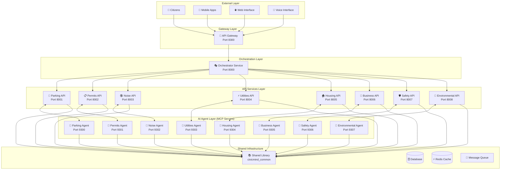
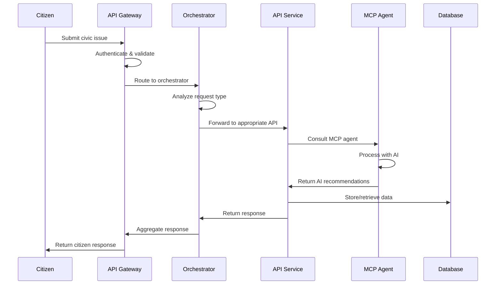
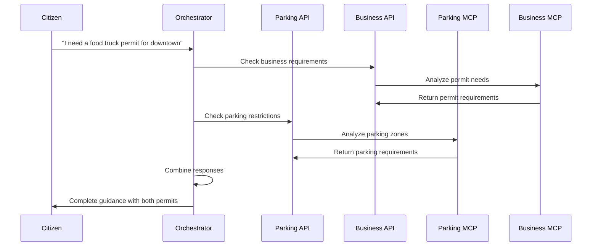

# 🏗️ CivicMind AI Architecture

## Overview

CivicMind AI is built on a **microservices architecture** that enables scalable, independent, and domain-specific civic services. The platform consists of API services, MCP (Model Context Protocol) servers, an API Gateway, and an orchestrator service that work together to provide intelligent civic assistance.

## 🌐 Architecture Diagram



## 🏗️ Core Components

### 1. API Gateway (Port 8300)
- **Purpose**: Single entry point for all civic services
- **Responsibilities**:
  - Request routing and load balancing
  - Authentication and authorization
  - Rate limiting and security
  - API versioning and documentation
  - Intelligent service discovery
- **Technology**: FastAPI with async request handling
- **Location**: `independent-services/civicmind-api-gateway/`

### 2. Orchestrator Service (Port 8000)
- **Purpose**: Coordinates complex workflows across multiple services
- **Responsibilities**:
  - Multi-service orchestration
  - Business process management
  - Transaction coordination
  - Service health monitoring
  - Workflow state management
- **Technology**: FastAPI with distributed task processing
- **Location**: `independent-services/civicmind-orchestrator-service/`

### 3. Civic API Services (Ports 8001-8008)
Independent REST API services for each civic domain:

| Service | Port | Domain | Responsibilities |
|---------|------|--------|------------------|
| **Parking** | 8001 | 🚗 | Violations, permits, meter payments, enforcement |
| **Permits** | 8002 | 📋 | Building permits, business licenses, inspections |
| **Noise** | 8003 | 🔇 | Noise complaints, ordinance violations, resolution |
| **Utilities** | 8004 | ⚡ | Outage reporting, service requests, billing |
| **Housing** | 8005 | 🏠 | Housing assistance, code violations, programs |
| **Business** | 8006 | 🏢 | Business registration, incentives, compliance |
| **Safety** | 8007 | 🛡️ | Safety inspections, emergency response, hazards |
| **Environmental** | 8008 | 🌱 | Environmental compliance, sustainability programs |

**Common Features**:
- RESTful API design
- OpenAPI/Swagger documentation
- Health check endpoints
- Metrics and monitoring
- Independent database schemas
- Docker containerization

### 4. MCP Servers (Ports 9300-9307)
AI-powered agents implementing Model Context Protocol:

| MCP Server | Port | AI Capabilities |
|------------|------|-----------------|
| **Parking Agent** | 9300 | Smart violation analysis, permit guidance |
| **Permits Agent** | 9301 | Requirement analysis, application assistance |
| **Noise Agent** | 9302 | Complaint categorization, ordinance lookup |
| **Utilities Agent** | 9303 | Outage diagnosis, service optimization |
| **Housing Agent** | 9304 | Program eligibility, assistance matching |
| **Business Agent** | 9305 | Registration guidance, incentive discovery |
| **Safety Agent** | 9306 | Hazard assessment, compliance checking |
| **Environmental Agent** | 9307 | Impact analysis, program recommendations |

**MCP Protocol Features**:
- Standardized tool interfaces
- Resource management
- Bidirectional communication
- Context sharing
- Tool composition

### 5. Shared Library (civicmind_common)
Common functionality shared across all services:

```
shared-lib/civicmind_common/
├── models/
│   ├── base_models.py      # Common data models
│   ├── agent_models.py     # MCP-specific models
│   └── api_models.py       # API request/response models
├── auth/
│   ├── jwt_handler.py      # JWT authentication
│   └── permissions.py      # Role-based access control
├── utils/
│   ├── logging.py          # Centralized logging
│   ├── health_checks.py    # Health monitoring
│   ├── metrics.py          # Performance metrics
│   └── cache.py            # Caching utilities
├── clients/
│   ├── openai_client.py    # OpenAI integration
│   └── database_client.py  # Database connections
└── config/
    └── settings.py         # Configuration management
```

## 🔄 Data Flow

### 1. Citizen Request Flow


### 2. Multi-Service Workflow


## 🔒 Security Architecture

### Authentication & Authorization
- **JWT-based authentication** with refresh tokens
- **Role-based access control** (RBAC)
- **API key management** for service-to-service communication
- **OAuth 2.0 integration** for third-party services

### Security Layers
1. **Network Security**: TLS/SSL encryption, VPN access
2. **Application Security**: Input validation, SQL injection prevention
3. **API Security**: Rate limiting, request signing, CORS policies
4. **Data Security**: Encryption at rest, PII anonymization

### Compliance
- **GDPR compliance** for data privacy
- **SOC 2 Type II** security standards
- **FISMA compliance** for government systems
- **Audit logging** for all operations

## 📊 Monitoring & Observability

### Health Monitoring
- **Service health checks** on all endpoints
- **Dependency health verification**
- **Circuit breakers** for fault tolerance
- **Graceful degradation** strategies

### Metrics Collection
```python
# Example metrics tracked
{
    "service_metrics": {
        "requests_per_second": 145.2,
        "average_response_time": "120ms",
        "error_rate": "0.02%",
        "uptime": "99.98%"
    },
    "business_metrics": {
        "issues_resolved": 1247,
        "citizen_satisfaction": 4.7,
        "automation_rate": "85%"
    }
}
```

### Logging Strategy
- **Structured logging** with JSON format
- **Correlation IDs** for request tracing
- **Log aggregation** with ELK stack
- **Alert thresholds** for critical issues

## 🚀 Deployment Architecture

### Development Environment
```yaml
# docker-compose.dev.yml
services:
  api-gateway:
    build: ./independent-services/civicmind-api-gateway
    ports: ["8300:8300"]
    environment:
      - ENV=development
      - DEBUG=true
  
  orchestrator:
    build: ./independent-services/civicmind-orchestrator-service
    ports: ["8000:8000"]
  
  parking-api:
    build: ./independent-services/civicmind-parking-service
    ports: ["8001:8001"]
  
  parking-mcp:
    build: ./independent-services/civicmind-parking-mcp-server
    ports: ["9300:9300"]
```

### Production Environment
- **Kubernetes orchestration** with Helm charts
- **Auto-scaling** based on demand
- **Multi-zone deployment** for high availability
- **Blue-green deployments** for zero downtime
- **Service mesh** (Istio) for secure communication

### Container Strategy
- **Multi-stage Docker builds** for optimization
- **Base images** with security updates
- **Resource limits** and health checks
- **Secrets management** with Kubernetes secrets

## 🔧 Configuration Management

### Environment-Based Configuration
```python
# Example configuration structure
{
    "development": {
        "database_url": "sqlite:///civic_dev.db",
        "redis_url": "redis://localhost:6379",
        "log_level": "DEBUG",
        "openai_api_key": "${OPENAI_API_KEY}"
    },
    "production": {
        "database_url": "${DATABASE_URL}",
        "redis_url": "${REDIS_URL}",
        "log_level": "INFO",
        "openai_api_key": "${OPENAI_API_KEY}"
    }
}
```

### Service Discovery
- **Consul** for service registry
- **Health check integration**
- **Load balancer configuration**
- **Circuit breaker patterns**

## 📈 Scalability Patterns

### Horizontal Scaling
- **Stateless service design**
- **Database sharding** by civic domain
- **Read replicas** for query optimization
- **CDN integration** for static assets

### Performance Optimization
- **Connection pooling**
- **Response caching** with Redis
- **Async request processing**
- **Database query optimization**

### Capacity Planning
- **Auto-scaling metrics**: CPU, memory, request rate
- **Predictive scaling** based on historical data
- **Resource allocation** per service
- **Cost optimization** strategies

## 🔄 CI/CD Pipeline

### Development Workflow
1. **Feature branch** development
2. **Automated testing** (unit, integration, e2e)
3. **Code quality checks** (linting, security scanning)
4. **Peer review** process
5. **Staging deployment**
6. **Production deployment**

### Testing Strategy
- **Unit tests** for individual components
- **Integration tests** for service interactions
- **End-to-end tests** for complete workflows
- **Load testing** for performance validation
- **Security testing** for vulnerability assessment

## 🔗 Integration Patterns

### External System Integration
- **Legacy system adapters**
- **Third-party API wrappers**
- **Data synchronization** strategies
- **Event-driven architecture**

### Inter-Service Communication
- **Synchronous**: REST APIs for real-time requests
- **Asynchronous**: Message queues for background processing
- **Event streaming**: For real-time updates
- **Circuit breakers**: For fault tolerance

## 📝 Best Practices

### Development Guidelines
1. **Domain-driven design** for service boundaries
2. **API-first development** with OpenAPI specs
3. **Test-driven development** for reliability
4. **Documentation as code**
5. **Security by design**

### Operational Excellence
1. **Infrastructure as code** (Terraform)
2. **Automated monitoring** and alerting
3. **Disaster recovery** planning
4. **Performance optimization**
5. **Cost management**

---

This architecture enables CivicMind AI to provide scalable, reliable, and intelligent civic services while maintaining the flexibility to evolve and integrate with existing government systems.