# 🏗️ CivicMind AI Commercial Architecture

## Executive Summary

This document outlines the evolution of CivicMind AI from a monolithic civic engagement tool into a **commercial-grade, multi-tenant SaaS platform** that can serve municipalities, government agencies, and civic technology providers at scale.

## 🎯 Strategic Vision

**Mission**: Build the world's first **Civic Intelligence as a Service (CIaaS)** platform that enables any organization to deploy AI-powered civic engagement solutions.

**Value Proposition**:
- 🏛️ **For Municipalities**: Turnkey civic AI without infrastructure overhead
- 🔧 **For Developers**: Civic AI APIs and tools for rapid application development
- 🌍 **For Citizens**: Consistent, intelligent civic assistance across jurisdictions
- 💼 **For Partners**: White-label civic AI solutions for government contractors

---

## 🏗️ **Next-Generation Architecture**

### **High-Level Architecture Overview**

```mermaid
graph TB
    subgraph "🌐 External Interfaces"
        UI[Web/Mobile UI]
        API[External APIs]
        WH[Webhooks]
        SSO[SSO/Auth Providers]
    end
    
    subgraph "🚪 API Gateway Layer"
        GW[API Gateway/Load Balancer]
        AUTH[Authentication Service]
        RATE[Rate Limiting]
        CACHE[Response Cache]
    end
    
    subgraph "🤖 AI Agent Layer (MCP Servers)"
        MCP1[Parking MCP Server]
        MCP2[Permits MCP Server] 
        MCP3[Infrastructure MCP Server]
        MCP4[Environmental MCP Server]
        MCP5[Housing MCP Server]
        MCP6[Custom Domain MCP]
    end
    
    subgraph "⚡ Orchestration Layer"
        LG1[Parking LangGraph Workflow]
        LG2[Permits LangGraph Workflow]
        LG3[Infrastructure LangGraph Workflow]
        LG4[Multi-Agent LangGraph]
        LG5[Escalation LangGraph]
    end
    
    subgraph "🔌 Data Integration Layer"
        311API[311 API Connector]
        GOVAPI[Government API Hub]
        GISAPI[GIS/Mapping APIs]
        OPENDATA[Open Data Connectors]
        SOCRATA[Socrata APIs]
        WEBHOOKS[Webhook Processors]
    end
    
    subgraph "📊 Data Platform"
        VECTOR[Vector Database]
        CIVIC[Civic Knowledge Base]
        GRAPH[Knowledge Graph]
        TIMESERIES[Time Series DB]
        CACHE_DB[Redis Cache]
        PRIMARY[PostgreSQL Primary]
    end
    
    subgraph "☁️ Cloud Infrastructure"
        K8S[Kubernetes Orchestration]
        MONITORING[Observability Stack]
        SECURITY[Security & Compliance]
        BACKUP[Backup & DR]
    end
    
    UI --> GW
    API --> GW
    WH --> GW
    SSO --> AUTH
    
    GW --> AUTH
    GW --> RATE
    GW --> CACHE
    
    AUTH --> MCP1
    AUTH --> MCP2
    AUTH --> MCP3
    AUTH --> MCP4
    AUTH --> MCP5
    AUTH --> MCP6
    
    MCP1 --> LG1
    MCP2 --> LG2
    MCP3 --> LG3
    MCP4 --> LG4
    MCP5 --> LG5
    
    LG1 --> 311API
    LG2 --> GOVAPI
    LG3 --> GISAPI
    LG4 --> OPENDATA
    LG5 --> SOCRATA
    
    311API --> VECTOR
    GOVAPI --> CIVIC
    GISAPI --> GRAPH
    OPENDATA --> TIMESERIES
    
    VECTOR --> CACHE_DB
    CIVIC --> PRIMARY
    
    K8S --> MONITORING
    K8S --> SECURITY
    K8S --> BACKUP
```



### **Architecture Layers Explained**

#### **1. 🌐 Multi-Channel Interface Layer**
- **Web/Mobile Applications**: React/Flutter frontends
- **API Consumers**: Third-party integrations, mobile apps
- **Voice Interfaces**: Alexa, Google Assistant integration
- **SMS/WhatsApp**: Text-based civic assistance
- **Webhook Endpoints**: Real-time updates from external systems

#### **2. 🚪 Enterprise API Gateway**
- **Kong/AWS API Gateway**: Traffic management, authentication, rate limiting
- **OAuth 2.0/OIDC**: Enterprise SSO integration (Azure AD, Okta)
- **Multi-tenant routing**: Route requests to appropriate tenant infrastructure
- **API versioning**: Backward compatibility for client applications
- **Analytics & monitoring**: Real-time API performance metrics

#### **3. 🤖 MCP (Model Context Protocol) Agent Servers**
Each civic domain runs as an independent MCP server:

```python
# Example: Parking MCP Server
from mcp import Server
from mcp.types import Tool, TextContent

class ParkingMCPServer:
    def __init__(self):
        self.server = Server("parking-civic-ai")
        self.register_tools()
    
    def register_tools(self):
        @self.server.tool()
        async def analyze_parking_issue(
            description: str,
            location: str,
            citizen_info: dict
        ) -> TextContent:
            """Analyze parking violation or dispute"""
            # LangGraph workflow execution
            workflow = ParkingWorkflow()
            result = await workflow.execute({
                "issue": description,
                "location": location,
                "citizen": citizen_info
            })
            return TextContent(text=result.recommendations)
        
        @self.server.tool()
        async def get_parking_regulations(
            location: str
        ) -> TextContent:
            """Get local parking regulations"""
            # Connect to municipal APIs
            regulations = await self.municipal_api.get_parking_regs(location)
            return TextContent(text=regulations)
```

#### **4. ⚡ LangGraph Process Orchestration**
Each MCP server uses LangGraph for complex workflow orchestration:

```python
from langgraph.graph import StateGraph, END
from langgraph.prebuilt import ToolExecutor

class ParkingWorkflow:
    def __init__(self):
        self.workflow = StateGraph(ParkingState)
        self.build_workflow()
    
    def build_workflow(self):
        # Define workflow nodes
        self.workflow.add_node("classify_issue", self.classify_parking_issue)
        self.workflow.add_node("check_regulations", self.check_local_regulations)
        self.workflow.add_node("community_first", self.suggest_community_resolution)
        self.workflow.add_node("escalate_official", self.escalate_to_authorities)
        self.workflow.add_node("generate_documents", self.generate_forms)
        
        # Define workflow edges
        self.workflow.add_edge("classify_issue", "check_regulations")
        self.workflow.add_conditional_edges(
            "check_regulations",
            self.should_try_community_first,
            {
                "community": "community_first",
                "official": "escalate_official"
            }
        )
        
        self.workflow.set_entry_point("classify_issue")
```

#### **5. 🔌 Data Integration Platform**
Unified connectors for all civic data sources:

```python
class CivicDataPlatform:
    def __init__(self):
        self.connectors = {
            "311": Municipal311Connector(),
            "gis": GISDataConnector(),
            "open_data": OpenDataConnector(),
            "permit_systems": PermitSystemConnector(),
            "court_records": CourtRecordsConnector(),
            "property_data": PropertyDataConnector()
        }
    
    async def unified_search(self, query: CivicQuery) -> CivicData:
        """Search across all civic data sources"""
        tasks = []
        for connector in self.connectors.values():
            if connector.supports_query(query):
                tasks.append(connector.search(query))
        
        results = await asyncio.gather(*tasks)
        return self.merge_civic_data(results)
```

---

## 🌟 **Commercial Service Provider Model**

### **1. Multi-Tenant SaaS Architecture**

```python
# Tenant isolation at multiple levels
class TenantManager:
    def __init__(self):
        self.tenant_configs = {}
        self.tenant_databases = {}
        self.tenant_ai_models = {}
    
    async def provision_tenant(self, org_id: str, config: TenantConfig):
        """Provision new municipal customer"""
        
        # 1. Database tenant isolation
        tenant_db = await self.create_tenant_database(org_id)
        
        # 2. AI model customization
        tenant_model = await self.customize_ai_models(org_id, config.local_regulations)
        
        # 3. API endpoints
        tenant_endpoints = await self.provision_api_endpoints(org_id)
        
        # 4. Domain/subdomain
        await self.setup_custom_domain(org_id, config.domain)
        
        return TenantDeployment(
            org_id=org_id,
            database=tenant_db,
            ai_models=tenant_model,
            endpoints=tenant_endpoints
        )
```

### **2. Pricing and Billing Model**

```yaml
# SaaS Pricing Tiers
pricing_tiers:
  starter:
    monthly_cost: $2,999
    included:
      - Up to 1,000 civic queries/month
      - 2 agent types (parking, permits)
      - Basic 311 integration
      - Email support
    
  professional:
    monthly_cost: $9,999
    included:
      - Up to 10,000 civic queries/month
      - All 8 agent types
      - Full API integrations
      - Custom branding
      - Phone support
      - SLA: 99.5% uptime
    
  enterprise:
    monthly_cost: $24,999
    included:
      - Unlimited civic queries
      - Custom agent development
      - White-label deployment
      - Dedicated infrastructure
      - 24/7 support
      - SLA: 99.9% uptime
      - Compliance certifications

usage_based_pricing:
  api_calls: $0.10 per 100 calls above tier limit
  custom_agents: $5,000 development + $500/month hosting
  premium_integrations: $1,000-5,000 setup + monthly fees
```

### **3. Revenue Streams**

1. **🏛️ Municipality Subscriptions** ($3K-$25K/month per city)
2. **🔧 Developer API Access** ($0.01-$0.10 per API call)
3. **⚙️ Custom Agent Development** ($10K-$50K per specialized agent)
4. **🤝 White-Label Partnerships** (20-30% revenue share)
5. **📊 Premium Data & Analytics** ($1K-$5K/month add-ons)
6. **🎓 Training & Consulting** ($2K-$10K per engagement)

---

## 🛡️ **Compliance & Security Framework**

### **Government Compliance Requirements**

```yaml
compliance_frameworks:
  federal:
    - FISMA (Federal Information Security Management Act)
    - Section 508 (Accessibility)
    - FOIA (Freedom of Information Act)
    - Privacy Act of 1974
    
  state_local:
    - State sunshine laws
    - Municipal transparency requirements
    - Local accessibility ordinances
    
  data_protection:
    - SOC 2 Type II certification
    - GDPR compliance (for international)
    - CCPA compliance (California)
    - HIPAA (for health-related civic data)
    
  security_standards:
    - ISO 27001
    - NIST Cybersecurity Framework
    - FedRAMP (for federal customers)
```

### **Data Sovereignty & Privacy**

```python
class DataSovereigntyManager:
    def __init__(self):
        self.data_classification = {
            "public": "Open civic data, publicly accessible",
            "sensitive": "PII, requires encryption and access controls",
            "confidential": "Internal government data, restricted access",
            "restricted": "Law enforcement sensitive, highest security"
        }
    
    async def handle_data_request(self, request: DataRequest) -> DataResponse:
        """Handle data with appropriate privacy controls"""
        
        # 1. Classify data sensitivity
        classification = await self.classify_data(request.data_type)
        
        # 2. Apply appropriate controls
        if classification == "sensitive":
            request.data = await self.anonymize_pii(request.data)
        elif classification == "confidential":
            await self.verify_clearance_level(request.user)
        
        # 3. Audit all access
        await self.audit_data_access(request)
        
        return await self.process_request(request)
```

---

## 🚀 **Cloud-Native Deployment Strategy**

### **Multi-Cloud Architecture**

```yaml
# Terraform/Kubernetes deployment
infrastructure:
  primary_cloud: AWS
  secondary_cloud: Azure  # DR and compliance
  edge_locations: CloudFlare
  
kubernetes_architecture:
  control_plane: EKS/AKS managed
  worker_nodes: 
    - general_purpose: m5.xlarge (API services)
    - compute_optimized: c5.2xlarge (AI workloads)
    - memory_optimized: r5.xlarge (data processing)
  
  namespaces:
    - system: Core platform services
    - tenant-{org-id}: Isolated tenant workloads
    - monitoring: Observability stack
    - data: Database and storage services

auto_scaling:
  horizontal_pod_autoscaler:
    min_replicas: 2
    max_replicas: 100
    target_cpu: 70%
  
  vertical_pod_autoscaler:
    enabled: true
    update_mode: "Auto"
  
  cluster_autoscaler:
    min_nodes: 3
    max_nodes: 50
```

### **Cost Optimization Strategy**

```python
class CostOptimizationEngine:
    def __init__(self):
        self.cost_policies = {
            "ai_compute": "Use spot instances for non-critical AI workloads",
            "data_storage": "Tiered storage: hot -> warm -> cold -> archive",
            "api_gateway": "Cache frequently accessed endpoints",
            "database": "Read replicas for tenant isolation"
        }
    
    async def optimize_tenant_costs(self, tenant_id: str):
        """Optimize infrastructure costs per tenant"""
        
        usage_patterns = await self.analyze_usage(tenant_id)
        
        recommendations = []
        
        if usage_patterns.peak_hours < 8:
            recommendations.append(
                "Schedule AI workloads during off-peak hours"
            )
        
        if usage_patterns.data_access_pattern == "read_heavy":
            recommendations.append(
                "Increase read replica ratio"
            )
        
        return CostOptimizationPlan(
            tenant_id=tenant_id,
            current_cost=usage_patterns.monthly_cost,
            optimized_cost=self.calculate_optimized_cost(recommendations),
            recommendations=recommendations
        )
```

---

## 📈 **Scalability & Performance Architecture**

### **Event-Driven Architecture**

```python
# Apache Kafka for event streaming
from kafka import KafkaProducer, KafkaConsumer

class CivicEventSystem:
    def __init__(self):
        self.producer = KafkaProducer(
            bootstrap_servers=['kafka1:9092', 'kafka2:9092'],
            value_serializer=lambda v: json.dumps(v).encode('utf-8')
        )
        self.event_schemas = {
            "civic.issue.created": CivicIssueCreatedEvent,
            "civic.issue.resolved": CivicIssueResolvedEvent,
            "civic.agent.response": AgentResponseEvent,
            "civic.escalation.required": EscalationEvent
        }
    
    async def publish_event(self, event_type: str, data: dict):
        """Publish civic events for downstream processing"""
        event = {
            "event_type": event_type,
            "timestamp": datetime.utcnow().isoformat(),
            "tenant_id": data.get("tenant_id"),
            "data": data
        }
        
        self.producer.send(f"civic.{event_type}", event)
        
        # Trigger real-time workflows
        await self.trigger_workflows(event_type, event)
```

### **Caching Strategy**

```python
class CivicCacheManager:
    def __init__(self):
        self.redis_cluster = redis.RedisCluster(
            startup_nodes=[
                {"host": "redis1", "port": 7000},
                {"host": "redis2", "port": 7000},
                {"host": "redis3", "port": 7000}
            ]
        )
        self.cache_strategies = {
            "agent_responses": {"ttl": 3600, "strategy": "lru"},
            "municipal_data": {"ttl": 86400, "strategy": "lfu"},
            "user_sessions": {"ttl": 1800, "strategy": "ttl"},
            "api_responses": {"ttl": 300, "strategy": "write_through"}
        }
    
    async def get_or_compute(self, key: str, compute_func: callable, cache_type: str):
        """Get from cache or compute and cache"""
        cached_value = await self.redis_cluster.get(key)
        
        if cached_value:
            return json.loads(cached_value)
        
        # Compute value
        value = await compute_func()
        
        # Cache with appropriate strategy
        strategy = self.cache_strategies[cache_type]
        await self.redis_cluster.setex(
            key, 
            strategy["ttl"], 
            json.dumps(value)
        )
        
        return value
```

---

## 🔧 **Development & Operations Framework**

### **API-First Development**

```yaml
# OpenAPI 3.0 specification for all services
openapi: 3.0.3
info:
  title: CivicMind AI Platform API
  version: 2.0.0
  description: Commercial-grade civic intelligence platform

servers:
  - url: https://api.civicmind.ai/v2
    description: Production API
  - url: https://staging-api.civicmind.ai/v2
    description: Staging API

paths:
  /tenants/{tenant_id}/issues:
    post:
      summary: Submit civic issue for AI analysis
      parameters:
        - name: tenant_id
          in: path
          required: true
          schema:
            type: string
      requestBody:
        required: true
        content:
          application/json:
            schema:
              $ref: '#/components/schemas/CivicIssueRequest'
      responses:
        '200':
          description: AI analysis completed
          content:
            application/json:
              schema:
                $ref: '#/components/schemas/CivicIssueResponse'

components:
  schemas:
    CivicIssueRequest:
      type: object
      required:
        - description
        - location
      properties:
        description:
          type: string
          minLength: 10
          maxLength: 2000
        location:
          type: string
        priority:
          type: string
          enum: [low, medium, high, urgent]
        citizen_info:
          $ref: '#/components/schemas/CitizenInfo'
```

### **CI/CD Pipeline**

```yaml
# .github/workflows/platform-deploy.yml
name: CivicMind Platform Deployment

on:
  push:
    branches: [main, develop]
  pull_request:
    branches: [main]

jobs:
  test:
    runs-on: ubuntu-latest
    strategy:
      matrix:
        service: [api-gateway, parking-mcp, permits-mcp, orchestrator]
    
    steps:
    - uses: actions/checkout@v3
    
    - name: Run service tests
      run: |
        cd services/${{ matrix.service }}
        pytest --cov=. --cov-report=xml
    
    - name: Upload coverage
      uses: codecov/codecov-action@v3

  security_scan:
    runs-on: ubuntu-latest
    steps:
    - uses: actions/checkout@v3
    
    - name: Run Snyk security scan
      uses: snyk/actions/python@master
      env:
        SNYK_TOKEN: ${{ secrets.SNYK_TOKEN }}

  build_and_deploy:
    needs: [test, security_scan]
    runs-on: ubuntu-latest
    if: github.ref == 'refs/heads/main'
    
    steps:
    - name: Deploy to staging
      run: |
        kubectl apply -f k8s/staging/
        kubectl rollout status deployment/civicmind-platform
    
    - name: Run integration tests
      run: |
        pytest tests/integration/ --env=staging
    
    - name: Deploy to production
      if: success()
      run: |
        kubectl apply -f k8s/production/
        kubectl rollout status deployment/civicmind-platform
```

---

## 💼 **Go-to-Market Strategy**

### **Target Market Segmentation**

```python
target_markets = {
    "tier_1_cities": {
        "description": "Major metropolitan areas (500K+ population)",
        "examples": ["San Francisco", "Seattle", "Austin", "Denver"],
        "pain_points": [
            "High volume of 311 calls",
            "Citizen engagement challenges", 
            "Multi-language support needs",
            "Integration complexity"
        ],
        "value_proposition": "AI-powered automation reducing 311 load by 40%",
        "pricing": "Enterprise tier ($25K+/month)",
        "sales_cycle": "9-18 months"
    },
    
    "tier_2_cities": {
        "description": "Mid-size cities (100K-500K population)",
        "examples": ["Folsom", "Davis", "Palo Alto", "Berkeley"],
        "pain_points": [
            "Limited IT resources",
            "Budget constraints",
            "Staff expertise gaps",
            "Citizen expectations rising"
        ],
        "value_proposition": "Turnkey civic AI without infrastructure overhead",
        "pricing": "Professional tier ($10K/month)",
        "sales_cycle": "6-12 months"
    },
    
    "government_contractors": {
        "description": "Companies serving government clients",
        "examples": ["Accenture Federal", "Deloitte", "IBM Government"],
        "pain_points": [
            "Need civic AI capabilities",
            "Time-to-market pressure",
            "Compliance requirements",
            "White-label needs"
        ],
        "value_proposition": "White-label civic AI platform",
        "pricing": "Revenue share model (20-30%)",
        "sales_cycle": "12-24 months"
    }
}
```

### **Partnership Ecosystem**

```python
partnership_strategy = {
    "technology_partners": {
        "aws": "Preferred cloud deployment, AWS Marketplace listing",
        "microsoft": "Azure Government cloud, Teams integration",
        "salesforce": "Government cloud CRM integration",
        "esri": "GIS data integration partnership"
    },
    
    "integration_partners": {
        "tyler_technologies": "Municipal software integration",
        "accela": "Permit system connectors",
        "seeclickfix": "311 platform integration",
        "socrata": "Open data platform partnership"
    },
    
    "channel_partners": {
        "government_contractors": "Reseller program with 25-35% margins",
        "civic_consultants": "Implementation partner program",
        "system_integrators": "Technical integration specialists"
    }
}
```

---

## 🎯 **Implementation Roadmap**

### **Phase 1: Platform Foundation (Months 1-6)**
- ✅ Refactor existing codebase to microservices
- ✅ Implement MCP server architecture
- ✅ Build multi-tenant infrastructure
- ✅ Develop API gateway and authentication
- ✅ Create basic admin dashboard

### **Phase 2: Commercial Features (Months 7-12)**
- 🔧 Implement billing and subscription management
- 🔧 Build customer onboarding automation
- 🔧 Develop white-label capabilities
- 🔧 Add advanced analytics and reporting
- 🔧 Implement compliance and security features

### **Phase 3: Market Expansion (Months 13-18)**
- 🚀 Launch with 5 pilot municipalities
- 🚀 Develop marketplace for custom agents
- 🚀 Build partner ecosystem
- 🚀 Add AI model customization features
- 🚀 Implement advanced workflow orchestration

### **Phase 4: Scale & Growth (Months 19-24)**
- 📈 Expand to 50+ municipal customers
- 📈 Launch federal government offerings
- 📈 International expansion (Canada, EU)
- 📈 AI model marketplace
- 📈 Advanced predictive analytics

---

## 💡 **Innovation Opportunities**

### **1. AI-Powered Predictive Governance**
```python
class PredictiveGovernanceEngine:
    """Predict civic issues before they become problems"""
    
    async def predict_infrastructure_failures(self, city_data: CityData):
        """Predict pothole formation, water main breaks, etc."""
        pass
    
    async def forecast_permit_demand(self, historical_data: PermitData):
        """Predict busy periods for permit processing"""
        pass
    
    async def identify_emerging_issues(self, social_media_data: SocialData):
        """Detect trending civic concerns from social media"""
        pass
```

### **2. Civic Digital Twin**
```python
class CivicDigitalTwin:
    """Real-time digital representation of city operations"""
    
    def __init__(self):
        self.real_time_data = {
            "traffic_flow": TrafficSensorData(),
            "permit_applications": PermitSystemData(),
            "311_requests": ServiceRequestData(),
            "social_sentiment": SocialMediaData()
        }
    
    async def simulate_policy_impact(self, policy_change: PolicyChange):
        """Simulate impact of policy changes before implementation"""
        pass
```

### **3. Blockchain-Based Civic Records**
```python
class CivicBlockchain:
    """Immutable record of civic interactions and decisions"""
    
    async def record_civic_decision(self, decision: CivicDecision):
        """Create immutable record of government decisions"""
        pass
    
    async def verify_permit_authenticity(self, permit_id: str):
        """Verify permit authenticity via blockchain"""
        pass
```

---

This architecture positions CivicMind AI as a **transformative civic technology platform** that can scale from a single municipality to a global SaaS provider serving hundreds of cities and government agencies. The modular, API-first, cloud-native design ensures scalability, compliance, and commercial viability.

**Key Success Factors**:
1. **Technical Excellence**: Robust, scalable, secure platform
2. **Market Fit**: Solving real municipal pain points
3. **Business Model**: Sustainable, scalable pricing
4. **Compliance**: Meeting government requirements
5. **Ecosystem**: Strong partner and integration network

Would you like me to elaborate on any specific aspect of this architecture or help implement any particular component?
