# 🎭 Advanced Orchestration Examples

This guide demonstrates complex multi-service workflows using CivicMind AI's orchestrator service to coordinate between multiple civic domains.

## 📋 Overview

The Orchestrator Service enables sophisticated workflows that span multiple civic services, providing citizens with comprehensive solutions that require coordination between different government departments.

## 🏗️ Orchestration Architecture

```mermaid
graph TB
    subgraph "Citizen Request Layer"
        Citizen[👤 Citizen Request]
        Gateway[🚪 API Gateway]
    end
    
    subgraph "Orchestration Layer"
        Orchestrator[🎭 Orchestrator Service]
        WorkflowEngine[⚙️ Workflow Engine]
        StateManager[📊 State Manager]
    end
    
    subgraph "Service Layer"
        BusinessAPI[🏢 Business Service]
        PermitsAPI[📋 Permits Service]
        SafetyAPI[🛡️ Safety Service]
        ParkingAPI[🚗 Parking Service]
        HealthAPI[🏥 Health Service]
    end
    
    subgraph "MCP Agent Layer"
        BusinessMCP[🤖 Business Agent]
        PermitsMCP[🤖 Permits Agent]
        SafetyMCP[🤖 Safety Agent]
        ParkingMCP[🤖 Parking Agent]
        HealthMCP[🤖 Health Agent]
    end
    
    Citizen --> Gateway
    Gateway --> Orchestrator
    Orchestrator --> WorkflowEngine
    WorkflowEngine --> StateManager
    
    WorkflowEngine --> BusinessAPI
    WorkflowEngine --> PermitsAPI
    WorkflowEngine --> SafetyAPI
    WorkflowEngine --> ParkingAPI
    WorkflowEngine --> HealthAPI
    
    BusinessAPI <--> BusinessMCP
    PermitsAPI <--> PermitsMCP
    SafetyAPI <--> SafetyMCP
    ParkingAPI <--> ParkingMCP
    HealthAPI <--> HealthMCP
```



## 🚀 Example 1: Restaurant Opening Workflow

### Scenario
A citizen wants to open a new restaurant downtown. This requires coordination between multiple departments for licenses, permits, inspections, and compliance.

### Workflow Definition

```python
# File: orchestrator-workflows/restaurant_opening_workflow.py
"""
Restaurant Opening Workflow
Coordinates multiple services for restaurant business licensing
"""

import asyncio
from typing import Dict, Any, List
from datetime import datetime, timedelta
from enum import Enum

class WorkflowStep(str, Enum):
    BUSINESS_LICENSE = "business_license"
    ZONING_CHECK = "zoning_check"
    HEALTH_PERMIT = "health_permit"
    LIQUOR_LICENSE = "liquor_license"
    FIRE_INSPECTION = "fire_inspection"
    BUILDING_PERMIT = "building_permit"
    PARKING_ASSESSMENT = "parking_assessment"
    FINAL_APPROVAL = "final_approval"

class RestaurantOpeningWorkflow:
    """
    Comprehensive workflow for opening a restaurant business
    """
    
    def __init__(self, orchestrator_client):
        self.orchestrator = orchestrator_client
        self.workflow_steps = [
            WorkflowStep.BUSINESS_LICENSE,
            WorkflowStep.ZONING_CHECK,
            WorkflowStep.HEALTH_PERMIT,
            WorkflowStep.BUILDING_PERMIT,
            WorkflowStep.FIRE_INSPECTION,
            WorkflowStep.PARKING_ASSESSMENT,
            WorkflowStep.LIQUOR_LICENSE,  # Optional - only if serving alcohol
            WorkflowStep.FINAL_APPROVAL
        ]
    
    async def execute(self, application_data: Dict[str, Any]) -> Dict[str, Any]:
        """
        Execute the complete restaurant opening workflow
        """
        workflow_id = f"RESTO-{datetime.now().strftime('%Y%m%d-%H%M%S')}"
        
        workflow_context = {
            "workflow_id": workflow_id,
            "application_data": application_data,
            "completed_steps": [],
            "pending_steps": [],
            "failed_steps": [],
            "total_estimated_cost": 0,
            "total_estimated_time": "6-12 weeks",
            "status": "in_progress",
            "started_at": datetime.now().isoformat()
        }
        
        try:
            # Step 1: Business License Application
            business_result = await self._process_business_license(application_data, workflow_context)
            workflow_context["completed_steps"].append({
                "step": WorkflowStep.BUSINESS_LICENSE,
                "result": business_result,
                "completed_at": datetime.now().isoformat()
            })
            
            # Step 2: Zoning Compliance Check
            zoning_result = await self._check_zoning_compliance(application_data, workflow_context)
            workflow_context["completed_steps"].append({
                "step": WorkflowStep.ZONING_CHECK,
                "result": zoning_result,
                "completed_at": datetime.now().isoformat()
            })
            
            # Step 3: Health Department Permit
            health_result = await self._process_health_permit(application_data, workflow_context)
            workflow_context["completed_steps"].append({
                "step": WorkflowStep.HEALTH_PERMIT,
                "result": health_result,
                "completed_at": datetime.now().isoformat()
            })
            
            # Step 4: Building Permit (if renovations needed)
            if application_data.get("requires_renovation", False):
                building_result = await self._process_building_permit(application_data, workflow_context)
                workflow_context["completed_steps"].append({
                    "step": WorkflowStep.BUILDING_PERMIT,
                    "result": building_result,
                    "completed_at": datetime.now().isoformat()
                })
            
            # Step 5: Fire Safety Inspection
            fire_result = await self._schedule_fire_inspection(application_data, workflow_context)
            workflow_context["completed_steps"].append({
                "step": WorkflowStep.FIRE_INSPECTION,
                "result": fire_result,
                "completed_at": datetime.now().isoformat()
            })
            
            # Step 6: Parking Assessment
            parking_result = await self._assess_parking_requirements(application_data, workflow_context)
            workflow_context["completed_steps"].append({
                "step": WorkflowStep.PARKING_ASSESSMENT,
                "result": parking_result,
                "completed_at": datetime.now().isoformat()
            })
            
            # Step 7: Liquor License (if applicable)
            if application_data.get("serves_alcohol", False):
                liquor_result = await self._process_liquor_license(application_data, workflow_context)
                workflow_context["completed_steps"].append({
                    "step": WorkflowStep.LIQUOR_LICENSE,
                    "result": liquor_result,
                    "completed_at": datetime.now().isoformat()
                })
            
            # Step 8: Final Approval Coordination
            final_result = await self._coordinate_final_approval(application_data, workflow_context)
            workflow_context["completed_steps"].append({
                "step": WorkflowStep.FINAL_APPROVAL,
                "result": final_result,
                "completed_at": datetime.now().isoformat()
            })
            
            workflow_context["status"] = "completed"
            workflow_context["completed_at"] = datetime.now().isoformat()
            
            return self._generate_workflow_summary(workflow_context)
            
        except Exception as e:
            workflow_context["status"] = "failed"
            workflow_context["error"] = str(e)
            workflow_context["failed_at"] = datetime.now().isoformat()
            
            # Attempt compensation for completed steps
            await self._compensate_workflow(workflow_context)
            
            return workflow_context
    
    async def _process_business_license(self, data: Dict[str, Any], context: Dict[str, Any]) -> Dict[str, Any]:
        """
        Process business license application
        """
        business_request = {
            "business_name": data["business_name"],
            "business_type": "restaurant",
            "owner_info": data["owner_info"],
            "business_address": data["business_address"],
            "estimated_employees": data.get("estimated_employees", 5)
        }
        
        # Call business service
        result = await self.orchestrator.call_service(
            "business-service",
            "/applications/business-license",
            business_request
        )
        
        # Update context with business license info
        context["business_license_id"] = result.get("license_id")
        context["total_estimated_cost"] += result.get("fee", 150)
        
        return {
            "license_id": result.get("license_id"),
            "status": "approved",
            "fee": result.get("fee", 150),
            "valid_until": (datetime.now() + timedelta(days=365)).isoformat(),
            "next_steps": ["Proceed with health permit application"]
        }
    
    async def _check_zoning_compliance(self, data: Dict[str, Any], context: Dict[str, Any]) -> Dict[str, Any]:
        """
        Check zoning compliance for restaurant location
        """
        zoning_request = {
            "address": data["business_address"],
            "business_type": "restaurant",
            "seating_capacity": data.get("seating_capacity", 50),
            "operating_hours": data.get("operating_hours", "6 AM - 10 PM"),
            "outdoor_seating": data.get("outdoor_seating", False)
        }
        
        # Call permits service for zoning check
        result = await self.orchestrator.call_service(
            "permits-service",
            "/zoning/check",
            zoning_request
        )
        
        return {
            "zoning_compliant": result.get("compliant", True),
            "zoning_district": result.get("district", "Commercial"),
            "restrictions": result.get("restrictions", []),
            "special_conditions": result.get("conditions", []),
            "next_steps": ["Zoning approved - proceed with health permit"]
        }
    
    async def _process_health_permit(self, data: Dict[str, Any], context: Dict[str, Any]) -> Dict[str, Any]:
        """
        Process health department permit and inspection
        """
        health_request = {
            "business_name": data["business_name"],
            "business_address": data["business_address"],
            "inspection_type": "restaurant",
            "menu_type": data.get("menu_type", "full_service"),
            "food_handling_training": data.get("food_handling_training", False)
        }
        
        # Call health service for permit
        permit_result = await self.orchestrator.call_service(
            "health-service",
            "/inspections/schedule",
            health_request
        )
        
        # Schedule health inspection
        inspection_result = await self.orchestrator.call_service(
            "health-service",
            "/inspections/schedule",
            {
                "business_id": context.get("business_license_id"),
                "inspection_type": "pre_opening",
                "urgency": "normal"
            }
        )
        
        context["total_estimated_cost"] += permit_result.get("fee", 300)
        
        return {
            "permit_id": permit_result.get("permit_id"),
            "inspection_scheduled": inspection_result.get("inspection_id"),
            "inspection_date": inspection_result.get("scheduled_date"),
            "fee": permit_result.get("fee", 300),
            "requirements": [
                "Food handler certification required",
                "Pre-opening inspection must pass",
                "Equipment specifications must be approved"
            ],
            "next_steps": ["Complete pre-opening health inspection"]
        }
    
    async def _process_building_permit(self, data: Dict[str, Any], context: Dict[str, Any]) -> Dict[str, Any]:
        """
        Process building permit for renovations
        """
        if not data.get("requires_renovation", False):
            return {"status": "not_required"}
        
        building_request = {
            "property_address": data["business_address"],
            "work_description": data.get("renovation_description", "Restaurant build-out"),
            "estimated_value": data.get("renovation_cost", 50000),
            "contractor_info": data.get("contractor_info", {})
        }
        
        # Call permits service for building permit
        result = await self.orchestrator.call_service(
            "permits-service",
            "/building/apply",
            building_request
        )
        
        context["total_estimated_cost"] += result.get("fee", 500)
        
        return {
            "permit_id": result.get("permit_id"),
            "fee": result.get("fee", 500),
            "inspections_required": result.get("inspections", [
                "Foundation inspection",
                "Electrical inspection",
                "Plumbing inspection",
                "Final inspection"
            ]),
            "estimated_approval_time": "4-6 weeks",
            "next_steps": ["Schedule required inspections"]
        }
    
    async def _schedule_fire_inspection(self, data: Dict[str, Any], context: Dict[str, Any]) -> Dict[str, Any]:
        """
        Schedule fire safety inspection
        """
        fire_request = {
            "business_name": data["business_name"],
            "business_address": data["business_address"],
            "occupancy_type": "restaurant",
            "max_occupancy": data.get("seating_capacity", 50),
            "kitchen_equipment": data.get("kitchen_equipment", []),
            "fire_suppression_system": data.get("fire_suppression", True)
        }
        
        # Call safety service for fire inspection
        result = await self.orchestrator.call_service(
            "safety-service",
            "/inspections/fire",
            fire_request
        )
        
        return {
            "inspection_id": result.get("inspection_id"),
            "scheduled_date": result.get("scheduled_date"),
            "inspector": result.get("inspector_info"),
            "requirements": [
                "Fire suppression system certification",
                "Emergency exit compliance",
                "Fire alarm system testing",
                "Kitchen hood system inspection"
            ],
            "estimated_duration": "2-3 hours",
            "next_steps": ["Pass fire inspection to proceed"]
        }
    
    async def _assess_parking_requirements(self, data: Dict[str, Any], context: Dict[str, Any]) -> Dict[str, Any]:
        """
        Assess parking requirements for restaurant
        """
        parking_request = {
            "business_address": data["business_address"],
            "business_type": "restaurant",
            "seating_capacity": data.get("seating_capacity", 50),
            "employees": data.get("estimated_employees", 5),
            "operating_hours": data.get("operating_hours", "6 AM - 10 PM")
        }
        
        # Call parking service for assessment
        result = await self.orchestrator.call_service(
            "parking-service",
            "/requirements/assess",
            parking_request
        )
        
        return {
            "required_spaces": result.get("required_spaces", 20),
            "available_spaces": result.get("available_spaces", 25),
            "compliance_status": result.get("compliant", True),
            "recommendations": result.get("recommendations", [
                "Adequate street parking available",
                "Consider validation for customer parking"
            ]),
            "additional_fees": result.get("fees", 0),
            "next_steps": ["Parking requirements satisfied"]
        }
    
    async def _process_liquor_license(self, data: Dict[str, Any], context: Dict[str, Any]) -> Dict[str, Any]:
        """
        Process liquor license application (if applicable)
        """
        if not data.get("serves_alcohol", False):
            return {"status": "not_applicable"}
        
        liquor_request = {
            "business_name": data["business_name"],
            "business_address": data["business_address"],
            "license_type": data.get("liquor_license_type", "beer_wine"),
            "owner_background_check": data.get("background_check_completed", False)
        }
        
        # Call business service for liquor license
        result = await self.orchestrator.call_service(
            "business-service",
            "/licenses/liquor",
            liquor_request
        )
        
        context["total_estimated_cost"] += result.get("fee", 1200)
        
        return {
            "license_id": result.get("license_id"),
            "license_type": result.get("license_type"),
            "fee": result.get("fee", 1200),
            "background_check_required": True,
            "public_notice_period": "30 days",
            "estimated_approval_time": "8-12 weeks",
            "next_steps": ["Complete background check and public notice period"]
        }
    
    async def _coordinate_final_approval(self, data: Dict[str, Any], context: Dict[str, Any]) -> Dict[str, Any]:
        """
        Coordinate final approval across all departments
        """
        # Verify all required approvals are complete
        required_approvals = [
            "business_license",
            "health_permit", 
            "fire_inspection",
            "zoning_compliance"
        ]
        
        if data.get("requires_renovation", False):
            required_approvals.append("building_permit")
        
        if data.get("serves_alcohol", False):
            required_approvals.append("liquor_license")
        
        # Check status of all approvals
        approval_status = {}
        for approval in required_approvals:
            # In a real implementation, would check actual status
            approval_status[approval] = "approved"
        
        # Generate final business operating permit
        final_permit = {
            "business_operating_permit": f"BOP-{context['workflow_id']}",
            "business_name": data["business_name"],
            "authorized_activities": ["Restaurant operation", "Food service"],
            "conditions": [
                "Must maintain current health permit",
                "Annual business license renewal required",
                "Fire inspection every 2 years"
            ],
            "valid_from": datetime.now().isoformat(),
            "valid_until": (datetime.now() + timedelta(days=365)).isoformat()
        }
        
        if data.get("serves_alcohol", False):
            final_permit["authorized_activities"].append("Alcohol service")
            final_permit["conditions"].append("Liquor license must remain current")
        
        return {
            "final_approval": "granted",
            "business_operating_permit": final_permit,
            "all_approvals_status": approval_status,
            "total_process_time": self._calculate_total_time(context),
            "total_cost": context["total_estimated_cost"],
            "next_steps": [
                "Business may commence operations",
                "Maintain all permits and licenses",
                "Schedule required renewals"
            ]
        }
    
    async def _compensate_workflow(self, context: Dict[str, Any]):
        """
        Compensate/rollback completed steps if workflow fails
        """
        completed_steps = context.get("completed_steps", [])
        
        for step_info in reversed(completed_steps):
            step = step_info["step"]
            result = step_info["result"]
            
            try:
                if step == WorkflowStep.BUSINESS_LICENSE:
                    await self._cancel_business_license(result)
                elif step == WorkflowStep.HEALTH_PERMIT:
                    await self._cancel_health_permit(result)
                elif step == WorkflowStep.BUILDING_PERMIT:
                    await self._cancel_building_permit(result)
                # Add other compensation actions as needed
                    
            except Exception as e:
                # Log compensation failure but continue
                print(f"Failed to compensate step {step}: {e}")
    
    def _calculate_total_time(self, context: Dict[str, Any]) -> str:
        """
        Calculate total time from start to completion
        """
        start_time = datetime.fromisoformat(context["started_at"])
        end_time = datetime.now()
        duration = end_time - start_time
        
        if duration.days > 0:
            return f"{duration.days} days"
        else:
            return f"{duration.seconds // 3600} hours"
    
    def _generate_workflow_summary(self, context: Dict[str, Any]) -> Dict[str, Any]:
        """
        Generate comprehensive workflow summary
        """
        return {
            "workflow_id": context["workflow_id"],
            "status": context["status"],
            "business_info": context["application_data"],
            "completed_steps": len(context["completed_steps"]),
            "total_cost": context["total_estimated_cost"],
            "processing_time": self._calculate_total_time(context),
            "approvals_obtained": [step["step"] for step in context["completed_steps"]],
            "final_permits": [
                step["result"] for step in context["completed_steps"] 
                if step["step"] == WorkflowStep.FINAL_APPROVAL
            ],
            "renewal_schedule": self._generate_renewal_schedule(context),
            "compliance_requirements": self._generate_compliance_requirements(context),
            "completed_at": context.get("completed_at"),
            "support_contacts": {
                "business_services": "business@city.gov",
                "health_department": "health@city.gov",
                "permits_office": "permits@city.gov",
                "general_inquiries": "311"
            }
        }
    
    def _generate_renewal_schedule(self, context: Dict[str, Any]) -> List[Dict[str, Any]]:
        """
        Generate renewal schedule for all permits and licenses
        """
        renewals = [
            {
                "permit_type": "Business License",
                "renewal_date": (datetime.now() + timedelta(days=365)).strftime("%Y-%m-%d"),
                "estimated_cost": 150,
                "reminder_date": (datetime.now() + timedelta(days=335)).strftime("%Y-%m-%d")
            },
            {
                "permit_type": "Health Permit",
                "renewal_date": (datetime.now() + timedelta(days=365)).strftime("%Y-%m-%d"),
                "estimated_cost": 300,
                "reminder_date": (datetime.now() + timedelta(days=335)).strftime("%Y-%m-%d")
            }
        ]
        
        # Add liquor license renewal if applicable
        if any("liquor" in step["step"] for step in context["completed_steps"]):
            renewals.append({
                "permit_type": "Liquor License",
                "renewal_date": (datetime.now() + timedelta(days=365)).strftime("%Y-%m-%d"),
                "estimated_cost": 1200,
                "reminder_date": (datetime.now() + timedelta(days=305)).strftime("%Y-%m-%d")
            })
        
        return renewals
    
    def _generate_compliance_requirements(self, context: Dict[str, Any]) -> List[str]:
        """
        Generate ongoing compliance requirements
        """
        requirements = [
            "Maintain current health permit through annual renewals",
            "Keep business license current and visible to public",
            "Comply with all fire safety regulations",
            "Submit required reports to health department",
            "Maintain proper insurance coverage"
        ]
        
        if any("liquor" in step["step"] for step in context["completed_steps"]):
            requirements.extend([
                "Comply with liquor service regulations",
                "Maintain responsible beverage service training",
                "Report any ownership changes to liquor control board"
            ])
        
        return requirements
```

## 🏠 Example 2: Housing Development Workflow

### Complex Multi-Department Coordination

```python
# File: orchestrator-workflows/housing_development_workflow.py
"""
Housing Development Workflow
Coordinates multiple services for residential development projects
"""

class HousingDevelopmentWorkflow:
    """
    Comprehensive workflow for housing development projects
    """
    
    async def execute(self, development_data: Dict[str, Any]) -> Dict[str, Any]:
        """
        Execute housing development approval workflow
        """
        workflow_id = f"HOUSING-{datetime.now().strftime('%Y%m%d-%H%M%S')}"
        
        # Phase 1: Pre-Development Approvals
        phase1_results = await self._execute_phase1(development_data, workflow_id)
        
        # Phase 2: Construction Permits
        phase2_results = await self._execute_phase2(development_data, workflow_id, phase1_results)
        
        # Phase 3: Infrastructure Coordination
        phase3_results = await self._execute_phase3(development_data, workflow_id, phase2_results)
        
        # Phase 4: Final Approvals and Certificates
        phase4_results = await self._execute_phase4(development_data, workflow_id, phase3_results)
        
        return self._compile_development_summary(
            workflow_id, development_data, 
            [phase1_results, phase2_results, phase3_results, phase4_results]
        )
    
    async def _execute_phase1(self, data: Dict[str, Any], workflow_id: str) -> Dict[str, Any]:
        """
        Phase 1: Zoning, Environmental, and Planning Approvals
        """
        phase_results = {"phase": "pre_development", "steps": []}
        
        # Step 1: Zoning Compliance and Variance (if needed)
        zoning_result = await self.orchestrator.call_service(
            "permits-service",
            "/zoning/development-review",
            {
                "property_address": data["property_address"],
                "development_type": data["development_type"],
                "units_proposed": data["units_proposed"],
                "building_height": data.get("building_height"),
                "density": data.get("density"),
                "parking_spaces": data.get("parking_spaces")
            }
        )
        phase_results["steps"].append({"zoning_review": zoning_result})
        
        # Step 2: Environmental Impact Assessment
        environmental_result = await self.orchestrator.call_service(
            "environmental-service",
            "/assessments/environmental-impact",
            {
                "project_scope": data["project_scope"],
                "property_size": data["property_size"],
                "environmental_features": data.get("environmental_features", []),
                "wetlands_present": data.get("wetlands_present", False)
            }
        )
        phase_results["steps"].append({"environmental_assessment": environmental_result})
        
        # Step 3: Traffic Impact Study
        traffic_result = await self.orchestrator.call_service(
            "parking-service",
            "/traffic/impact-study",
            {
                "development_location": data["property_address"],
                "estimated_traffic": data["estimated_daily_trips"],
                "peak_hours_impact": data.get("peak_hours_impact"),
                "parking_analysis": data.get("parking_analysis")
            }
        )
        phase_results["steps"].append({"traffic_study": traffic_result})
        
        # Step 4: Preliminary Plat Approval
        plat_result = await self.orchestrator.call_service(
            "permits-service",
            "/planning/preliminary-plat",
            {
                "subdivision_name": data.get("subdivision_name"),
                "lots_proposed": data["units_proposed"],
                "road_dedication": data.get("road_dedication"),
                "utility_easements": data.get("utility_easements")
            }
        )
        phase_results["steps"].append({"preliminary_plat": plat_result})
        
        return phase_results
    
    async def _execute_phase2(self, data: Dict[str, Any], workflow_id: str, phase1: Dict[str, Any]) -> Dict[str, Any]:
        """
        Phase 2: Construction and Building Permits
        """
        phase_results = {"phase": "construction_permits", "steps": []}
        
        # Step 1: Site Work Permit
        sitework_result = await self.orchestrator.call_service(
            "permits-service",
            "/construction/sitework",
            {
                "project_address": data["property_address"],
                "grading_plan": data.get("grading_plan"),
                "erosion_control": data.get("erosion_control_plan"),
                "stormwater_management": data.get("stormwater_plan")
            }
        )
        phase_results["steps"].append({"sitework_permit": sitework_result})
        
        # Step 2: Building Permits for each unit/building
        building_permits = []
        for building in data.get("buildings", [{"type": "residential", "units": data["units_proposed"]}]):
            permit_result = await self.orchestrator.call_service(
                "permits-service",
                "/building/residential",
                {
                    "building_type": building["type"],
                    "units": building["units"],
                    "square_footage": building.get("square_footage"),
                    "construction_type": building.get("construction_type", "wood_frame"),
                    "architectural_plans": building.get("plans_submitted", True)
                }
            )
            building_permits.append(permit_result)
        
        phase_results["steps"].append({"building_permits": building_permits})
        
        # Step 3: Utility Connections Coordination
        utility_result = await self.orchestrator.call_service(
            "utilities-service",
            "/connections/new-development",
            {
                "development_size": data["units_proposed"],
                "utility_types": ["water", "sewer", "electric", "gas"],
                "connection_points": data.get("utility_connection_points"),
                "capacity_requirements": data.get("utility_capacity")
            }
        )
        phase_results["steps"].append({"utility_coordination": utility_result})
        
        return phase_results
    
    async def _execute_phase3(self, data: Dict[str, Any], workflow_id: str, phase2: Dict[str, Any]) -> Dict[str, Any]:
        """
        Phase 3: Infrastructure and Safety Coordination
        """
        phase_results = {"phase": "infrastructure", "steps": []}
        
        # Step 1: Road and Infrastructure Improvements
        infrastructure_result = await self.orchestrator.call_service(
            "permits-service",
            "/infrastructure/road-improvements",
            {
                "development_impact": data["estimated_daily_trips"],
                "road_improvements_required": data.get("road_improvements"),
                "sidewalk_requirements": data.get("sidewalk_plan"),
                "street_lighting": data.get("lighting_plan")
            }
        )
        phase_results["steps"].append({"infrastructure_improvements": infrastructure_result})
        
        # Step 2: Fire Protection and Safety Review
        fire_safety_result = await self.orchestrator.call_service(
            "safety-service",
            "/reviews/fire-protection",
            {
                "development_type": data["development_type"],
                "units_count": data["units_proposed"],
                "building_heights": data.get("building_heights"),
                "fire_access_roads": data.get("fire_access"),
                "hydrant_locations": data.get("hydrant_plan")
            }
        )
        phase_results["steps"].append({"fire_safety_review": fire_safety_result})
        
        # Step 3: School Impact Assessment
        school_impact_result = await self.orchestrator.call_service(
            "permits-service",
            "/impact/school-assessment",
            {
                "residential_units": data["units_proposed"],
                "unit_types": data.get("unit_types", ["single_family"]),
                "estimated_students": data.get("estimated_students"),
                "school_district": data.get("school_district")
            }
        )
        phase_results["steps"].append({"school_impact": school_impact_result})
        
        return phase_results
    
    async def _execute_phase4(self, data: Dict[str, Any], workflow_id: str, phase3: Dict[str, Any]) -> Dict[str, Any]:
        """
        Phase 4: Final Approvals and Certificates
        """
        phase_results = {"phase": "final_approvals", "steps": []}
        
        # Step 1: Final Plat Approval
        final_plat_result = await self.orchestrator.call_service(
            "permits-service",
            "/planning/final-plat",
            {
                "preliminary_plat_id": "extracted_from_phase1",
                "construction_completion": data.get("construction_status"),
                "infrastructure_acceptance": data.get("infrastructure_complete"),
                "utility_acceptance": data.get("utilities_complete")
            }
        )
        phase_results["steps"].append({"final_plat": final_plat_result})
        
        # Step 2: Certificates of Occupancy
        occupancy_certificates = []
        for unit in range(data["units_proposed"]):
            cert_result = await self.orchestrator.call_service(
                "permits-service",
                "/certificates/occupancy",
                {
                    "unit_address": f"{data['property_address']} Unit {unit + 1}",
                    "building_permit_id": f"extracted_from_phase2_{unit}",
                    "final_inspections_complete": True,
                    "utility_connections_active": True
                }
            )
            occupancy_certificates.append(cert_result)
        
        phase_results["steps"].append({"occupancy_certificates": occupancy_certificates})
        
        # Step 3: Development Completion Certification
        completion_result = await self.orchestrator.call_service(
            "permits-service",
            "/development/completion-certificate",
            {
                "workflow_id": workflow_id,
                "all_permits_finalized": True,
                "infrastructure_accepted": True,
                "bonding_released": data.get("bonding_status", "pending")
            }
        )
        phase_results["steps"].append({"completion_certificate": completion_result})
        
        return phase_results
```

## 🚨 Example 3: Emergency Response Coordination

### Multi-Service Emergency Response

```python
# File: orchestrator-workflows/emergency_response_workflow.py
"""
Emergency Response Workflow
Coordinates multiple services for emergency situations
"""

class EmergencyResponseWorkflow:
    """
    Emergency response coordination across multiple city services
    """
    
    def __init__(self, orchestrator_client):
        self.orchestrator = orchestrator_client
        self.emergency_priorities = {
            "life_safety": 1,
            "property_protection": 2,
            "environmental_protection": 3,
            "service_restoration": 4
        }
    
    async def execute(self, emergency_data: Dict[str, Any]) -> Dict[str, Any]:
        """
        Execute emergency response coordination workflow
        """
        emergency_id = f"EMRG-{datetime.now().strftime('%Y%m%d-%H%M%S')}"
        emergency_type = emergency_data.get("emergency_type")
        severity = emergency_data.get("severity", "medium")
        
        # Determine response strategy based on emergency type
        response_strategy = self._determine_response_strategy(emergency_type, severity)
        
        # Execute immediate response
        immediate_results = await self._execute_immediate_response(emergency_data, emergency_id)
        
        # Coordinate ongoing response
        ongoing_results = await self._coordinate_ongoing_response(emergency_data, emergency_id, immediate_results)
        
        # Recovery coordination
        recovery_results = await self._coordinate_recovery(emergency_data, emergency_id, ongoing_results)
        
        return self._compile_emergency_summary(
            emergency_id, emergency_data, response_strategy,
            [immediate_results, ongoing_results, recovery_results]
        )
    
    def _determine_response_strategy(self, emergency_type: str, severity: str) -> Dict[str, Any]:
        """
        Determine appropriate response strategy
        """
        strategies = {
            "water_main_break": {
                "primary_services": ["utilities", "safety", "parking"],
                "response_time": "immediate",
                "coordination_level": "high",
                "public_notification": True
            },
            "gas_leak": {
                "primary_services": ["utilities", "safety", "health", "parking"],
                "response_time": "immediate",
                "coordination_level": "critical",
                "evacuation_potential": True
            },
            "building_collapse": {
                "primary_services": ["safety", "health", "utilities", "permits"],
                "response_time": "immediate",
                "coordination_level": "critical",
                "multi_agency_response": True
            },
            "flooding": {
                "primary_services": ["safety", "utilities", "environmental", "parking"],
                "response_time": "immediate",
                "coordination_level": "high",
                "area_impact": "wide"
            }
        }
        
        return strategies.get(emergency_type, {
            "primary_services": ["safety"],
            "response_time": "standard",
            "coordination_level": "medium"
        })
    
    async def _execute_immediate_response(self, data: Dict[str, Any], emergency_id: str) -> Dict[str, Any]:
        """
        Execute immediate emergency response actions
        """
        immediate_actions = {"phase": "immediate_response", "actions": []}
        
        # Safety Service - Emergency Response Team Dispatch
        safety_response = await self.orchestrator.call_service(
            "safety-service",
            "/emergency/dispatch",
            {
                "emergency_id": emergency_id,
                "emergency_type": data["emergency_type"],
                "location": data["location"],
                "severity": data["severity"],
                "caller_info": data.get("caller_info"),
                "immediate_hazards": data.get("immediate_hazards", [])
            }
        )
        immediate_actions["actions"].append({"safety_dispatch": safety_response})
        
        # Utilities Service - Emergency Shutoffs (if applicable)
        if data["emergency_type"] in ["gas_leak", "water_main_break", "electrical_hazard"]:
            utilities_response = await self.orchestrator.call_service(
                "utilities-service",
                "/emergency/shutoff",
                {
                    "emergency_id": emergency_id,
                    "location": data["location"],
                    "utility_type": self._determine_utility_type(data["emergency_type"]),
                    "affected_area": data.get("affected_area"),
                    "emergency_contact": data.get("caller_info")
                }
            )
            immediate_actions["actions"].append({"utilities_shutoff": utilities_response})
        
        # Parking/Traffic Service - Area Closure and Traffic Control
        if data.get("requires_area_closure", True):
            parking_response = await self.orchestrator.call_service(
                "parking-service",
                "/emergency/area-closure",
                {
                    "emergency_id": emergency_id,
                    "closure_area": data["location"],
                    "closure_radius": data.get("closure_radius", "1 block"),
                    "traffic_rerouting": True,
                    "emergency_vehicle_access": True
                }
            )
            immediate_actions["actions"].append({"area_closure": parking_response})
        
        # Health Service - Medical Response (if needed)
        if data.get("medical_response_needed", False) or data["emergency_type"] in ["gas_leak", "chemical_spill"]:
            health_response = await self.orchestrator.call_service(
                "health-service",
                "/emergency/medical-response",
                {
                    "emergency_id": emergency_id,
                    "incident_type": data["emergency_type"],
                    "location": data["location"],
                    "potential_exposures": data.get("potential_exposures", []),
                    "evacuation_area": data.get("evacuation_area")
                }
            )
            immediate_actions["actions"].append({"medical_response": health_response})
        
        return immediate_actions
    
    async def _coordinate_ongoing_response(self, data: Dict[str, Any], emergency_id: str, immediate: Dict[str, Any]) -> Dict[str, Any]:
        """
        Coordinate ongoing emergency response activities
        """
        ongoing_actions = {"phase": "ongoing_response", "actions": []}
        
        # Public Notification System
        notification_response = await self.orchestrator.call_service(
            "safety-service",
            "/emergency/public-notification",
            {
                "emergency_id": emergency_id,
                "notification_type": data.get("notification_type", "area_alert"),
                "affected_area": data.get("affected_area"),
                "message": self._generate_public_message(data),
                "channels": ["emergency_alert", "website", "social_media"],
                "update_frequency": data.get("update_frequency", "hourly")
            }
        )
        ongoing_actions["actions"].append({"public_notification": notification_response})
        
        # Resource Coordination
        resource_response = await self.orchestrator.call_service(
            "safety-service",
            "/emergency/resource-coordination",
            {
                "emergency_id": emergency_id,
                "required_resources": data.get("required_resources", []),
                "mutual_aid_needed": data.get("mutual_aid", False),
                "specialized_equipment": data.get("specialized_equipment", []),
                "personnel_requirements": data.get("personnel_needs")
            }
        )
        ongoing_actions["actions"].append({"resource_coordination": resource_response})
        
        # Environmental Monitoring (if applicable)
        if data["emergency_type"] in ["chemical_spill", "gas_leak", "hazmat_incident"]:
            environmental_response = await self.orchestrator.call_service(
                "environmental-service",
                "/emergency/monitoring",
                {
                    "emergency_id": emergency_id,
                    "monitoring_type": data.get("monitoring_type", "air_quality"),
                    "monitoring_locations": data.get("monitoring_points", []),
                    "sampling_frequency": data.get("sampling_frequency", "continuous"),
                    "alert_thresholds": data.get("alert_thresholds")
                }
            )
            ongoing_actions["actions"].append({"environmental_monitoring": environmental_response})
        
        # Infrastructure Assessment
        infrastructure_response = await self.orchestrator.call_service(
            "permits-service",
            "/emergency/infrastructure-assessment",
            {
                "emergency_id": emergency_id,
                "affected_infrastructure": data.get("affected_infrastructure", []),
                "damage_assessment_needed": True,
                "structural_engineers_needed": data.get("structural_assessment", False),
                "utility_damage_assessment": data.get("utility_damage", False)
            }
        )
        ongoing_actions["actions"].append({"infrastructure_assessment": infrastructure_response})
        
        return ongoing_actions
    
    async def _coordinate_recovery(self, data: Dict[str, Any], emergency_id: str, ongoing: Dict[str, Any]) -> Dict[str, Any]:
        """
        Coordinate recovery and restoration activities
        """
        recovery_actions = {"phase": "recovery", "actions": []}
        
        # Damage Assessment and Documentation
        damage_assessment = await self.orchestrator.call_service(
            "permits-service",
            "/recovery/damage-assessment",
            {
                "emergency_id": emergency_id,
                "preliminary_damage": data.get("estimated_damage"),
                "affected_properties": data.get("affected_properties", []),
                "infrastructure_damage": data.get("infrastructure_damage", []),
                "assessment_teams": data.get("assessment_teams_deployed")
            }
        )
        recovery_actions["actions"].append({"damage_assessment": damage_assessment})
        
        # Utility Restoration Coordination
        utility_restoration = await self.orchestrator.call_service(
            "utilities-service",
            "/recovery/restoration-plan",
            {
                "emergency_id": emergency_id,
                "affected_utilities": data.get("affected_utilities", []),
                "restoration_priority": self._determine_restoration_priority(data),
                "estimated_restoration_time": data.get("estimated_restoration"),
                "temporary_services_needed": data.get("temporary_services", [])
            }
        )
        recovery_actions["actions"].append({"utility_restoration": utility_restoration})
        
        # Permit Expediting for Repairs
        permit_expediting = await self.orchestrator.call_service(
            "permits-service",
            "/recovery/expedited-permits",
            {
                "emergency_id": emergency_id,
                "repair_permits_needed": data.get("repair_permits", []),
                "demolition_permits": data.get("demolition_needed", []),
                "temporary_structures": data.get("temporary_structures", []),
                "expedited_processing": True
            }
        )
        recovery_actions["actions"].append({"permit_expediting": permit_expediting})
        
        # Public Health Follow-up
        health_followup = await self.orchestrator.call_service(
            "health-service",
            "/recovery/health-followup",
            {
                "emergency_id": emergency_id,
                "health_monitoring_needed": data.get("ongoing_health_monitoring", False),
                "environmental_cleanup": data.get("environmental_cleanup", []),
                "public_health_advisories": data.get("health_advisories", []),
                "medical_surveillance": data.get("medical_surveillance", False)
            }
        )
        recovery_actions["actions"].append({"health_followup": health_followup})
        
        return recovery_actions
    
    def _determine_utility_type(self, emergency_type: str) -> str:
        """
        Determine which utility needs emergency action
        """
        utility_mapping = {
            "gas_leak": "natural_gas",
            "water_main_break": "water",
            "electrical_hazard": "electric",
            "sewer_backup": "sewer"
        }
        return utility_mapping.get(emergency_type, "unknown")
    
    def _generate_public_message(self, data: Dict[str, Any]) -> str:
        """
        Generate appropriate public notification message
        """
        emergency_type = data["emergency_type"]
        location = data["location"]
        
        messages = {
            "gas_leak": f"EMERGENCY ALERT: Gas leak reported at {location}. Avoid the area. Emergency crews responding.",
            "water_main_break": f"WATER EMERGENCY: Major water main break at {location}. Expect service disruptions and avoid the area.",
            "building_collapse": f"EMERGENCY: Building collapse at {location}. Area closed to traffic. Avoid the area.",
            "flooding": f"FLOOD WARNING: Flooding reported in {location} area. Use alternate routes and exercise caution."
        }
        
        return messages.get(emergency_type, f"EMERGENCY: Incident reported at {location}. Emergency crews responding.")
    
    def _determine_restoration_priority(self, data: Dict[str, Any]) -> List[str]:
        """
        Determine utility restoration priority
        """
        priority_order = [
            "emergency_services",
            "hospitals_medical",
            "schools",
            "residential_areas",
            "commercial_areas",
            "industrial_areas"
        ]
        
        return priority_order
```

## 📊 Testing Orchestrator Workflows

### Integration Testing

```python
# File: tests/integration/test_orchestrator_workflows.py
"""
Integration tests for orchestrator workflows
"""

import pytest
import asyncio
from unittest.mock import AsyncMock, Mock

class TestOrchestratorWorkflows:
    
    @pytest.fixture
    def mock_orchestrator(self):
        """Create mock orchestrator for testing"""
        orchestrator = Mock()
        orchestrator.call_service = AsyncMock()
        return orchestrator
    
    @pytest.mark.asyncio
    async def test_restaurant_opening_workflow(self, mock_orchestrator):
        """Test complete restaurant opening workflow"""
        
        # Mock service responses
        mock_orchestrator.call_service.side_effect = [
            {"license_id": "BL-2024-001", "fee": 150},  # Business license
            {"compliant": True, "district": "Commercial"},  # Zoning check
            {"permit_id": "HP-2024-001", "fee": 300},  # Health permit
            {"inspection_id": "HI-2024-001"},  # Health inspection
            {"permit_id": "BP-2024-001", "fee": 500},  # Building permit
            {"inspection_id": "FI-2024-001"},  # Fire inspection
            {"required_spaces": 20, "compliant": True},  # Parking assessment
            {"license_id": "LL-2024-001", "fee": 1200},  # Liquor license
            {"business_operating_permit": "BOP-2024-001"}  # Final approval
        ]
        
        # Test data
        application_data = {
            "business_name": "Test Restaurant",
            "business_address": "123 Main St",
            "owner_info": {"name": "John Doe"},
            "seating_capacity": 50,
            "serves_alcohol": True,
            "requires_renovation": True
        }
        
        # Execute workflow
        workflow = RestaurantOpeningWorkflow(mock_orchestrator)
        result = await workflow.execute(application_data)
        
        # Verify results
        assert result["status"] == "completed"
        assert len(result["completed_steps"]) == 8
        assert result["total_cost"] == 2150  # Sum of all fees
        assert "BOP-2024-001" in str(result["final_permits"])
    
    @pytest.mark.asyncio
    async def test_emergency_response_workflow(self, mock_orchestrator):
        """Test emergency response coordination"""
        
        # Mock emergency service responses
        mock_orchestrator.call_service.side_effect = [
            {"dispatch_id": "DISP-001", "units_dispatched": 3},  # Safety dispatch
            {"shutoff_id": "SO-001", "affected_customers": 150},  # Utility shutoff
            {"closure_id": "CL-001", "area_closed": "2 blocks"},  # Area closure
            {"notification_id": "PN-001", "channels_activated": 4},  # Public notification
            {"resource_id": "RC-001", "resources_deployed": ["crane", "pumps"]},  # Resources
            {"assessment_id": "DA-001", "damage_level": "moderate"},  # Damage assessment
            {"restoration_id": "UR-001", "estimated_time": "6 hours"}  # Utility restoration
        ]
        
        # Test emergency data
        emergency_data = {
            "emergency_type": "water_main_break",
            "location": "Main St & 5th Ave",
            "severity": "high",
            "affected_area": "Downtown district",
            "requires_area_closure": True,
            "estimated_damage": "moderate"
        }
        
        # Execute emergency workflow
        workflow = EmergencyResponseWorkflow(mock_orchestrator)
        result = await workflow.execute(emergency_data)
        
        # Verify emergency response
        assert "EMRG-" in result["emergency_id"]
        assert len(result["response_phases"]) == 3  # Immediate, ongoing, recovery
        assert result["public_notification"]["channels_activated"] == 4
        assert "6 hours" in result["recovery_timeline"]
```

## 🔧 Deployment and Monitoring

### Orchestrator Service Configuration

```yaml
# File: deployment/docker-compose.orchestrator.yml
version: '3.8'

services:
  # Enhanced Orchestrator Service
  orchestrator:
    build: ./independent-services/civicmind-orchestrator-service
    ports:
      - "8000:8000"
    environment:
      - DATABASE_URL=${ORCHESTRATOR_DATABASE_URL}
      - REDIS_URL=${REDIS_URL}
      - LOG_LEVEL=INFO
      - WORKFLOW_TIMEOUT=3600
      - MAX_CONCURRENT_WORKFLOWS=50
    depends_on:
      - postgres
      - redis
      - kafka  # For event streaming
    networks:
      - civicmind-network
    restart: unless-stopped
    healthcheck:
      test: ["CMD", "curl", "-f", "http://localhost:8000/health"]
      interval: 30s
      timeout: 10s
      retries: 3
    deploy:
      replicas: 3
      resources:
        limits:
          memory: 2G
          cpus: '1.5'
        reservations:
          memory: 1G
          cpus: '0.5'

  # Workflow State Database
  postgres:
    image: postgres:15
    environment:
      POSTGRES_DB: orchestrator
      POSTGRES_USER: ${DB_USER}
      POSTGRES_PASSWORD: ${DB_PASSWORD}
    volumes:
      - orchestrator_data:/var/lib/postgresql/data
      - ./sql/init-orchestrator.sql:/docker-entrypoint-initdb.d/init.sql
    networks:
      - civicmind-network

  # Message Queue for Async Processing
  kafka:
    image: confluentinc/cp-kafka:latest
    environment:
      KAFKA_ZOOKEEPER_CONNECT: zookeeper:2181
      KAFKA_ADVERTISED_LISTENERS: PLAINTEXT://kafka:9092
      KAFKA_OFFSETS_TOPIC_REPLICATION_FACTOR: 1
    depends_on:
      - zookeeper
    networks:
      - civicmind-network

  zookeeper:
    image: confluentinc/cp-zookeeper:latest
    environment:
      ZOOKEEPER_CLIENT_PORT: 2181
    networks:
      - civicmind-network

volumes:
  orchestrator_data:

networks:
  civicmind-network:
    external: true
```

## 📈 Workflow Monitoring Dashboard

### Metrics and Analytics

```python
# File: orchestrator-service/monitoring/workflow_metrics.py
"""
Workflow monitoring and metrics collection
"""

class WorkflowMetrics:
    """
    Collect and analyze workflow performance metrics
    """
    
    def __init__(self):
        self.workflow_stats = {}
        self.service_performance = {}
        self.failure_analysis = {}
    
    def record_workflow_start(self, workflow_id: str, workflow_type: str):
        """Record workflow initiation"""
        self.workflow_stats[workflow_id] = {
            "type": workflow_type,
            "start_time": datetime.now(),
            "status": "running",
            "steps_completed": 0,
            "services_called": []
        }
    
    def record_service_call(self, workflow_id: str, service_name: str, duration: float, success: bool):
        """Record service call performance"""
        if workflow_id in self.workflow_stats:
            self.workflow_stats[workflow_id]["services_called"].append({
                "service": service_name,
                "duration": duration,
                "success": success,
                "timestamp": datetime.now()
            })
        
        # Update service performance metrics
        if service_name not in self.service_performance:
            self.service_performance[service_name] = {
                "total_calls": 0,
                "successful_calls": 0,
                "average_duration": 0,
                "error_rate": 0
            }
        
        self.service_performance[service_name]["total_calls"] += 1
        if success:
            self.service_performance[service_name]["successful_calls"] += 1
    
    def get_workflow_analytics(self) -> Dict[str, Any]:
        """Get comprehensive workflow analytics"""
        return {
            "total_workflows": len(self.workflow_stats),
            "workflow_types": self._analyze_workflow_types(),
            "average_completion_time": self._calculate_average_completion_time(),
            "success_rate": self._calculate_success_rate(),
            "service_performance": self.service_performance,
            "bottleneck_analysis": self._identify_bottlenecks(),
            "failure_patterns": self._analyze_failure_patterns()
        }
```

## ✅ Best Practices Summary

### Orchestration Guidelines

1. **Workflow Design**
   - Keep workflows modular and composable
   - Implement proper error handling and compensation
   - Use timeouts and circuit breakers
   - Design for idempotency

2. **Service Coordination**
   - Minimize service dependencies
   - Use asynchronous processing where possible
   - Implement proper retry mechanisms
   - Monitor service health continuously

3. **State Management**
   - Persist workflow state for recovery
   - Use event sourcing for audit trails
   - Implement workflow versioning
   - Handle concurrent workflow execution

4. **Performance Optimization**
   - Parallel execution where possible
   - Optimize database queries
   - Use caching for repeated operations
   - Monitor and optimize resource usage

5. **Testing Strategies**
   - Unit test individual workflow steps
   - Integration test service interactions
   - End-to-end test complete workflows
   - Chaos engineering for resilience testing

---

This orchestration guide demonstrates how CivicMind AI's microservices architecture enables sophisticated multi-service workflows that provide citizens with comprehensive solutions requiring coordination across multiple government departments. The orchestrator service acts as the intelligent coordinator, ensuring smooth execution of complex civic processes while maintaining system reliability and performance.
