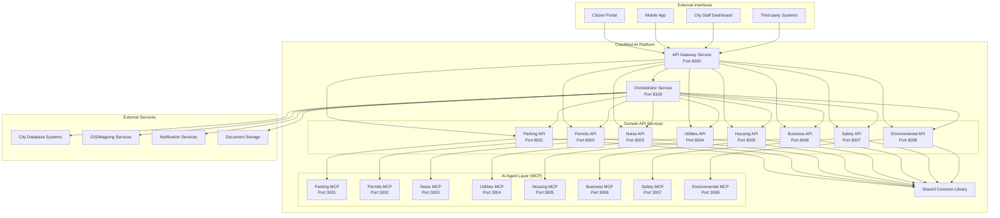

# CivicMind AI - Technical Architecture Overview

**Comprehensive technical architecture for enterprise evaluation**

---

## 🏗️ **System Architecture**

### **High-Level Architecture Diagram**



---

## 🔧 **Service Layer Breakdown**

### **1. API Gateway Service (Port 8300)**

**Purpose**: Central entry point for all external requests
**Technology**: FastAPI, Python 3.11+
**Responsibilities**:
- Request routing and load balancing
- Authentication and authorization
- Rate limiting and request throttling
- Request/response logging and monitoring
- API versioning and backward compatibility

**Key Features**:
```python
# Service discovery and routing
CIVIC_SERVICES = {
    "parking": {"url": "http://localhost:8001", "health": "/health"},
    "permits": {"url": "http://localhost:8002", "health": "/health"},
    # ... other services
}

# Intelligent routing based on issue classification
async def route_request(issue_description: str) -> str:
    classification = await classify_issue(issue_description)
    return CIVIC_SERVICES[classification["type"]]["url"]
```

### **2. Orchestrator Service (Port 8100)**

**Purpose**: Workflow coordination and multi-service orchestration
**Technology**: FastAPI, LangGraph, Python 3.11+
**Responsibilities**:
- Multi-step workflow execution
- Service coordination and communication
- State management across services
- Error handling and recovery
- Workflow monitoring and analytics

**Workflow Engine**:
```python
class CivicWorkflowEngine:
    async def orchestrate_resolution(self, issue: CivicIssue):
        # 1. Classify issue
        classification = await self.classify_issue(issue)
        
        # 2. Select appropriate services
        services = await self.select_services(classification)
        
        # 3. Execute coordinated workflow
        workflow = await self.create_workflow(classification, services)
        result = await self.execute_workflow(workflow)
        
        return result
```

### **3. Domain API Services (Ports 8001-8008)**

**Purpose**: Specialized REST APIs for specific civic domains
**Technology**: FastAPI, Pydantic, Python 3.11+
**Common Structure**:

```
civicmind-{domain}-api-service/
├── src/{domain}_service/
│   ├── main.py              # FastAPI application
│   ├── models/              # Pydantic data models
│   ├── services/            # Business logic layer
│   ├── agents/              # Domain-specific logic
│   └── config/              # Service configuration
├── tests/                   # Comprehensive test suite
├── deployment/              # Docker and K8s configs
└── docs/                    # Service documentation
```

**Example Domain Service (Parking)**:
```python
@app.post("/analyze", response_model=ParkingAnalysisResponse)
async def analyze_parking_issue(request: ParkingAnalysisRequest):
    """Analyze parking issue and provide recommendations"""
    analysis = await parking_service.analyze_issue(request)
    return analysis

@app.get("/health")
async def health_check():
    """Service health monitoring"""
    return {"status": "healthy", "service": "parking"}
```

### **4. MCP Agent Layer (Ports 3001-3008)**

**Purpose**: AI agent communication via Model Context Protocol
**Technology**: MCP Protocol, FastMCP, Python 3.11+
**Responsibilities**:
- Advanced AI reasoning and analysis
- Tool execution and resource access
- Complex decision-making workflows
- Integration with LLMs and AI models

**MCP Server Example**:
```python
app = FastMCP("civicmind-parking-mcp-server")

@app.list_tools()
async def list_tools() -> List[Tool]:
    return [
        Tool(
            name="analyze_parking_issue",
            description="Analyze parking violations and provide recommendations",
            inputSchema={
                "type": "object",
                "properties": {
                    "description": {"type": "string"},
                    "location": {"type": "string"}
                }
            }
        )
    ]

@app.call_tool()
async def call_tool(name: str, arguments: Dict[str, Any]):
    if name == "analyze_parking_issue":
        return await parking_agent.analyze_issue(**arguments)
```

---

## 🔄 **Data Flow Architecture**

### **Request Processing Flow**

```
1. Citizen Request → API Gateway
2. API Gateway → Issue Classification
3. Classification → Service Selection
4. Service Selection → Orchestrator
5. Orchestrator → Domain API Service
6. Domain API → MCP Agent
7. MCP Agent → AI Analysis
8. AI Analysis → Response Chain
9. Response Chain → Citizen
```

### **Example: Parking Issue Resolution**

```python
# 1. Citizen submits issue
POST /api/v1/issues
{
    "description": "Car blocking my driveway",
    "location": "123 Main Street"
}

# 2. API Gateway classifies and routes
classification = await classify_issue(description)
# Result: {"type": "parking", "confidence": 0.95}

# 3. Route to parking API service
response = await http_client.post(
    "http://parking-api:8001/analyze",
    json=issue_data
)

# 4. Parking service calls MCP agent
mcp_result = await mcp_client.call_tool(
    "analyze_parking_issue", 
    arguments=issue_data
)

# 5. Return comprehensive response
{
    "issue_id": "parking-12345",
    "classification": {"type": "driveway_blocking"},
    "recommendations": ["Try neighbor communication first"],
    "resolution_steps": [...],
    "contacts": [...],
    "estimated_resolution": "2-3 days"
}
```

---

## 📊 **Scalability & Performance**

### **Horizontal Scaling Design**

**Load Balancing**:
```yaml
# Kubernetes deployment example
apiVersion: apps/v1
kind: Deployment
metadata:
  name: parking-api-service
spec:
  replicas: 3  # Scale based on demand
  selector:
    matchLabels:
      app: parking-api
  template:
    spec:
      containers:
      - name: parking-api
        image: civicmind/parking-api:1.0.0
        ports:
        - containerPort: 8001
        resources:
          requests:
            memory: "256Mi"
            cpu: "250m"
          limits:
            memory: "512Mi"
            cpu: "500m"
```

**Performance Characteristics**:
- **Response Time**: < 500ms for simple classifications
- **Throughput**: 1000+ requests/minute per service instance
- **Availability**: 99.9% uptime with proper deployment
- **Scalability**: Linear scaling with load balancers

### **Caching Strategy**

```python
# Redis-based caching for common requests
@lru_cache(maxsize=1000)
async def get_parking_regulations(location: str):
    # Cache frequently accessed regulations
    return await regulation_service.get_by_location(location)

# Database query optimization
class ParkingIssue(BaseModel):
    # Indexed fields for fast queries
    location: str = Field(index=True)
    issue_type: str = Field(index=True)
    created_at: datetime = Field(index=True)
```

---

## 🔒 **Security & Authentication**

### **Security Architecture**

```
┌─────────────────┐    ┌─────────────────┐    ┌─────────────────┐
│   API Gateway   │    │  Auth Service   │    │  Domain APIs    │
│                 │    │                 │    │                 │
│ • Rate Limiting │    │ • JWT Tokens    │    │ • Token Valid.  │
│ • Input Valid.  │    │ • User Roles    │    │ • RBAC         │
│ • HTTPS Only    │    │ • Session Mgmt  │    │ • Data Encrypt. │
└─────────────────┘    └─────────────────┘    └─────────────────┘
```

**Authentication Flow**:
```python
# JWT-based authentication
class AuthService:
    async def authenticate_request(self, token: str) -> User:
        payload = jwt.decode(token, SECRET_KEY, algorithms=["HS256"])
        user = await self.get_user(payload["user_id"])
        return user
    
    async def authorize_action(self, user: User, action: str) -> bool:
        return action in user.permissions

# Role-based access control
USER_ROLES = {
    "citizen": ["submit_issue", "view_own_issues"],
    "staff": ["view_all_issues", "update_status"],
    "admin": ["manage_users", "system_config"]
}
```

**Data Protection**:
- **Encryption**: AES-256 for data at rest, TLS 1.3 for transport
- **Privacy**: PII tokenization and anonymization
- **Compliance**: GDPR, CCPA, and government data standards
- **Audit**: Comprehensive logging and audit trails

---

## 🗄️ **Data Architecture**

### **Database Design**

```sql
-- Core issue tracking
CREATE TABLE civic_issues (
    id UUID PRIMARY KEY,
    description TEXT NOT NULL,
    location VARCHAR(255),
    issue_type VARCHAR(50) INDEX,
    priority VARCHAR(20),
    status VARCHAR(30) INDEX,
    created_at TIMESTAMP INDEX,
    updated_at TIMESTAMP,
    assigned_service VARCHAR(50),
    citizen_id UUID,
    resolution_summary TEXT
);

-- Service workflow tracking
CREATE TABLE workflows (
    id UUID PRIMARY KEY,
    issue_id UUID REFERENCES civic_issues(id),
    workflow_type VARCHAR(50),
    current_step INTEGER,
    status VARCHAR(30),
    metadata JSONB,
    created_at TIMESTAMP,
    completed_at TIMESTAMP
);

-- Service interaction logs
CREATE TABLE service_interactions (
    id UUID PRIMARY KEY,
    workflow_id UUID REFERENCES workflows(id),
    service_name VARCHAR(50),
    action VARCHAR(100),
    request_data JSONB,
    response_data JSONB,
    duration_ms INTEGER,
    timestamp TIMESTAMP
);
```

### **Data Flow & Integration**

**External System Integration**:
```python
# City database integration
class CityDataIntegration:
    async def sync_property_data(self):
        # Sync with city property database
        properties = await city_api.get_properties()
        await self.update_local_cache(properties)
    
    async def update_permit_status(self, permit_id: str, status: str):
        # Update city permit system
        await city_permits_api.update_status(permit_id, status)
        
    async def get_enforcement_history(self, location: str):
        # Query city enforcement database
        return await city_enforcement_api.get_history(location)
```

---

## 🚀 **Deployment Architecture**

### **Container Strategy**

```dockerfile
# Multi-stage build for efficiency
FROM python:3.11-slim as builder
WORKDIR /app
COPY requirements.txt .
RUN pip install --no-cache-dir -r requirements.txt

FROM python:3.11-slim
COPY --from=builder /usr/local/lib/python3.11/site-packages /usr/local/lib/python3.11/site-packages
COPY src/ ./src/
EXPOSE 8001
CMD ["python", "-m", "parking_service.main"]
```

**Cloud Deployment Options**:

1. **Kubernetes (Recommended)**:
```yaml
apiVersion: v1
kind: Namespace
metadata:
  name: civicmind

---
apiVersion: apps/v1  
kind: Deployment
metadata:
  name: api-gateway
  namespace: civicmind
spec:
  replicas: 2
  selector:
    matchLabels:
      app: api-gateway
  template:
    metadata:
      labels:
        app: api-gateway
    spec:
      containers:
      - name: api-gateway
        image: civicmind/api-gateway:1.0.0
        ports:
        - containerPort: 8300
        env:
        - name: DATABASE_URL
          valueFrom:
            secretKeyRef:
              name: civicmind-secrets
              key: database-url
```

2. **Docker Compose (Development)**:
```yaml
version: '3.8'
services:
  api-gateway:
    build: ./civicmind-api-gateway-service
    ports:
      - "8300:8300"
    environment:
      - LOG_LEVEL=INFO
    depends_on:
      - redis
      - postgres
  
  parking-api:
    build: ./civicmind-parking-api-service
    ports:
      - "8001:8001"
    environment:
      - SERVICE_PORT=8001
    depends_on:
      - parking-mcp
  
  parking-mcp:
    build: ./civicmind-parking-mcp-server
    ports:
      - "3001:3001"
    environment:
      - MCP_PORT=3001
```

3. **Cloud Provider Specific**:
   - **AWS**: ECS, EKS, Lambda for serverless components
   - **Azure**: AKS, Container Instances, Functions
   - **GCP**: GKE, Cloud Run, Cloud Functions

---

## 📈 **Monitoring & Observability**

### **Health Monitoring**

```python
# Comprehensive health checks
@app.get("/health")
async def health_check():
    health_info = {
        "service": SERVICE_NAME,
        "status": "healthy",
        "version": SERVICE_VERSION,
        "timestamp": datetime.utcnow().isoformat(),
        "dependencies": {
            "database": await check_database_health(),
            "redis": await check_redis_health(),
            "external_apis": await check_external_apis()
        },
        "metrics": {
            "uptime_seconds": get_uptime(),
            "memory_usage_mb": get_memory_usage(),
            "active_connections": get_active_connections()
        }
    }
    
    # Return 503 if any critical dependency is down
    if any(dep["status"] != "healthy" for dep in health_info["dependencies"].values()):
        return JSONResponse(status_code=503, content=health_info)
    
    return health_info
```

### **Metrics & Analytics**

```python
# Prometheus metrics integration
from prometheus_client import Counter, Histogram, Gauge

REQUEST_COUNT = Counter('requests_total', 'Total requests', ['method', 'endpoint'])
REQUEST_DURATION = Histogram('request_duration_seconds', 'Request duration')
ACTIVE_ISSUES = Gauge('active_issues_total', 'Number of active issues')

@app.middleware("http")
async def metrics_middleware(request: Request, call_next):
    start_time = time.time()
    
    response = await call_next(request)
    
    duration = time.time() - start_time
    REQUEST_COUNT.labels(method=request.method, endpoint=request.url.path).inc()
    REQUEST_DURATION.observe(duration)
    
    return response
```

### **Logging Strategy**

```python
# Structured logging with correlation IDs
import structlog

logger = structlog.get_logger()

@app.middleware("http")
async def logging_middleware(request: Request, call_next):
    correlation_id = str(uuid.uuid4())
    
    with structlog.contextvars.bound_contextvars(
        correlation_id=correlation_id,
        service=SERVICE_NAME,
        endpoint=request.url.path,
        method=request.method
    ):
        logger.info("Request started")
        
        response = await call_next(request)
        
        logger.info(
            "Request completed",
            status_code=response.status_code,
            duration_ms=int((time.time() - start_time) * 1000)
        )
        
        response.headers["X-Correlation-ID"] = correlation_id
        return response
```

---

## 🔗 **Integration Capabilities**

### **API Integration Patterns**

**REST API Standards**:
```yaml
# OpenAPI specification example
openapi: 3.0.0
info:
  title: CivicMind Parking API
  version: 1.0.0
  description: Parking issue analysis and resolution
paths:
  /analyze:
    post:
      summary: Analyze parking issue
      requestBody:
        required: true
        content:
          application/json:
            schema:
              $ref: '#/components/schemas/ParkingIssueRequest'
      responses:
        '200':
          description: Analysis completed
          content:
            application/json:
              schema:
                $ref: '#/components/schemas/ParkingAnalysisResponse'
```

**Webhook Support**:
```python
# Event-driven notifications
class WebhookService:
    async def notify_issue_update(self, issue_id: str, status: str):
        webhook_urls = await self.get_registered_webhooks("issue_update")
        
        payload = {
            "event": "issue_update",
            "issue_id": issue_id,
            "status": status,
            "timestamp": datetime.utcnow().isoformat()
        }
        
        for url in webhook_urls:
            await self.send_webhook(url, payload)
```

**Third-party System Integration**:
```python
# City GIS system integration
class GISIntegration:
    async def validate_address(self, address: str) -> bool:
        # Validate against city address database
        response = await self.gis_client.get(f"/validate/{address}")
        return response.json()["valid"]
    
    async def get_zone_info(self, coordinates: tuple) -> dict:
        # Get zoning and regulatory info
        response = await self.gis_client.get(f"/zones/{coordinates}")
        return response.json()
```

---

## 🛡️ **Enterprise Security Features**

### **Security Controls**

```python
# API rate limiting
from slowapi import Limiter
from slowapi.util import get_remote_address

limiter = Limiter(key_func=get_remote_address)

@app.post("/analyze")
@limiter.limit("10/minute")  # Prevent abuse
async def analyze_issue(request: Request):
    pass

# Input validation and sanitization
class SecureIssueRequest(BaseModel):
    description: str = Field(max_length=1000, regex=r'^[a-zA-Z0-9\s\.,!?-]+$')
    location: Optional[str] = Field(max_length=200)
    
    @validator('description')
    def sanitize_description(cls, v):
        # Remove potential XSS content
        return html.escape(v)
```

### **Compliance Features**

```python
# GDPR compliance
class DataPrivacyService:
    async def anonymize_citizen_data(self, citizen_id: str):
        # Replace PII with anonymized identifiers
        await self.database.execute(
            "UPDATE civic_issues SET citizen_info = %s WHERE citizen_id = %s",
            (self.generate_anonymous_id(), citizen_id)
        )
    
    async def export_citizen_data(self, citizen_id: str) -> dict:
        # GDPR data export requirement
        return await self.database.fetch_citizen_data(citizen_id)
    
    async def delete_citizen_data(self, citizen_id: str):
        # Right to be forgotten
        await self.database.delete_citizen_records(citizen_id)
```

---

This technical architecture provides a comprehensive foundation for enterprise evaluation and implementation planning. The modular design ensures scalability, security, and maintainability while offering clear integration paths for existing city systems.
